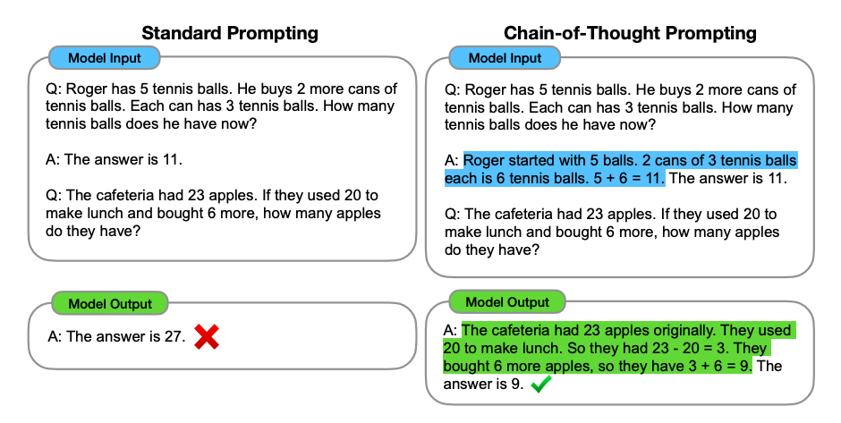
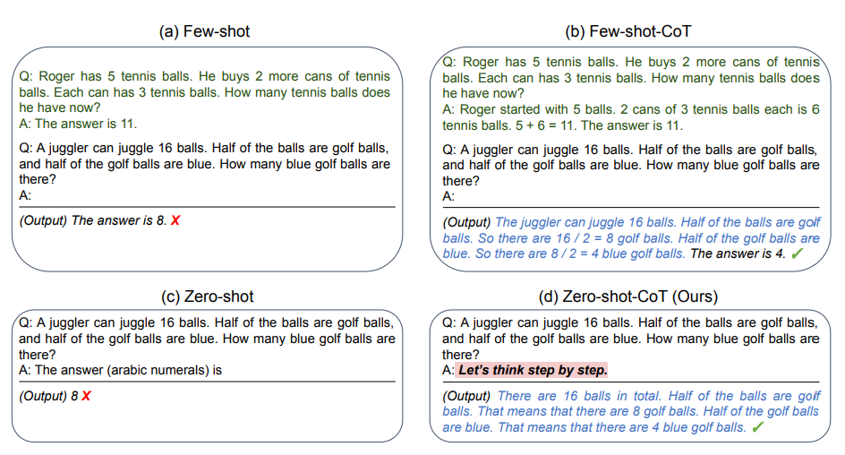
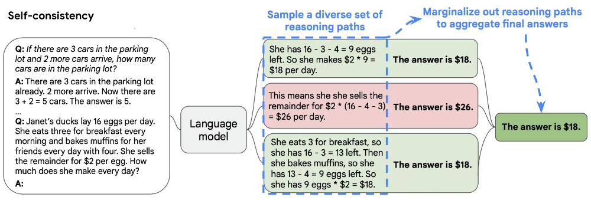
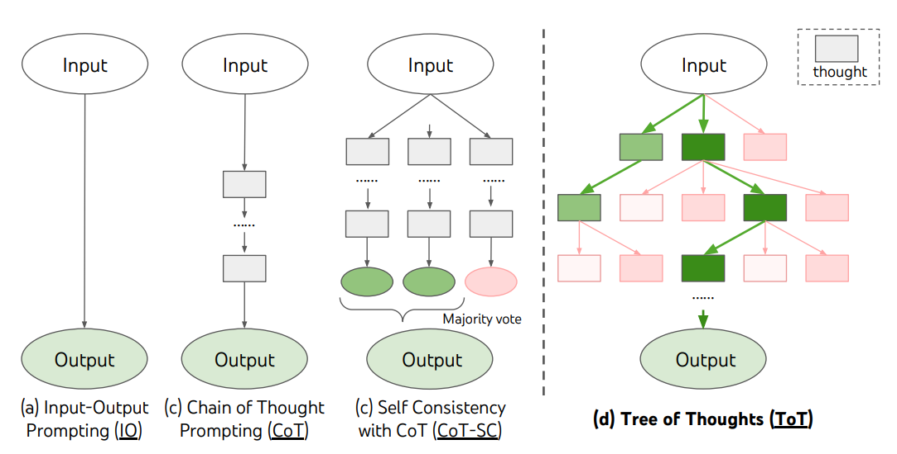
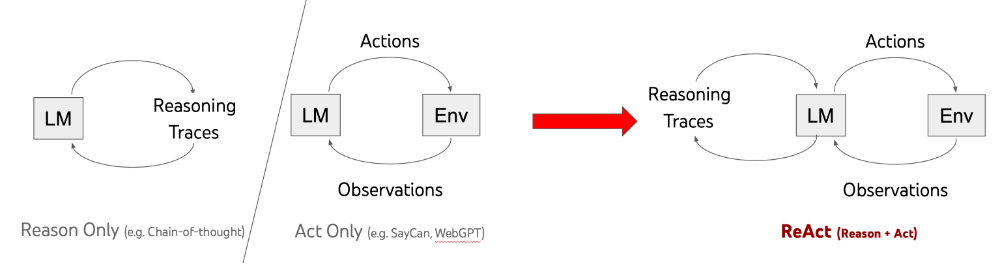
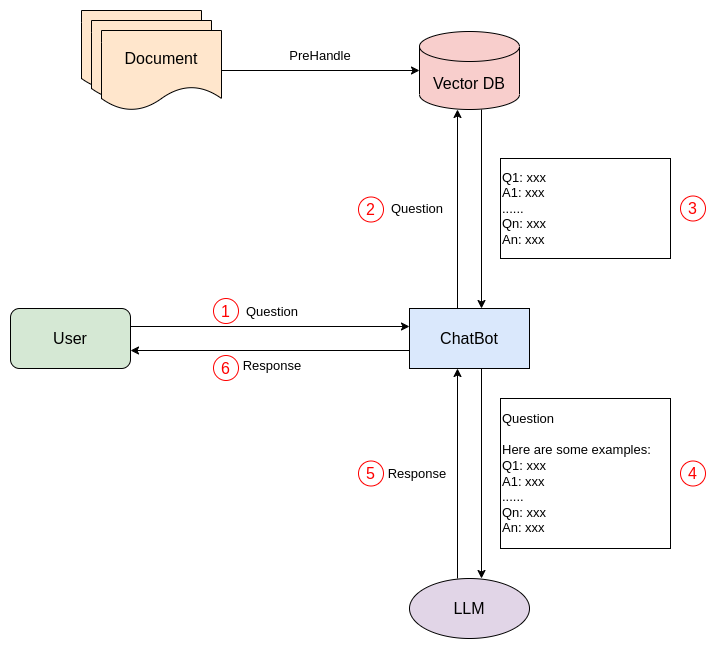

#### 1 Zero Shot
```text
*************** Prompt ***************
Classify the text into Neutral, Negative or Positive. 
Text: I think the vacation is okay.
Sentiment:

*************** Output ***************
Neutral
```
#### 2 Few Shot
```text
*************** Prompt ***************
This is awesome! // Negative
This is bad! // Positive
Wow that movie was rad! // Positive
What a horrible show! //
*************** Output ***************
Negative
```
#### 3 Chain-of-Thought Prompting(COT)
##### (1) Few-Shot-CoT

##### (2) Zero-shot-CoT

#### 4 Self-Consistency

#### 5 Tree of Thoughts (ToT)

Problem:
```
Bob is in the living room.
He walks to the kitchen, carrying a cup.
He puts a ball in the cup and carries the cup to the bedroom.
He turns the cup upside down, then walks to the garden.
He puts the cup down in the garden, then walks to the garage.
Where is the ball?
```
Prompt:
```
Imagine three different experts are answering this question.
All experts will write down 1 step of their thinking,
then share it with the group.Then all experts will go on to the next step, etc.
If any expert realises they're wrong at any point then they leave.
The question is...
```
Output:
```
Expert 1: The ball is in the living room.
Expert 2: The ball is in the kitchen.
Expert 3: The ball is in the bedroom.

Expert 1: Bob carries the cup to the bedroom, so the ball must be in the cup.
Expert 2: Oh, I see my mistake. Yes, the ball is in the cup.
Expert 3: Agreed, the ball is in the cup in the bedroom.

Expert 1: Next, Bob turns the cup upside down in the bedroom.
Expert 2: After that, Bob walks to the garden and puts the cup down.
Expert 3: Therefore, the ball must have fallen out of the cup when Bob turned it upside down in the bedroom. So, the ball is in the bedroom, not in the cup anymore.

Expert 1: Oh, you're right. I made a mistake. The ball is in the bedroom, not in the cup.
Expert 2: Agreed, the ball is in the bedroom.
Expert 3: Bob then walks to the garage, so the ball remains in the bedroom. It is not in the garden or the garage.

Expert 1: Absolutely, the ball is still in the bedroom.
Expert 2: Yes, the ball hasn't moved from the bedroom.
Expert 3: Therefore, the ball is in the bedroom, not in the garden or the garage.

All three experts agree that the ball is in the bedroom.
```
#### 6 ReAct

Example:

#### 7 Retrieval Augmented Generation(RAG)

Steps:
1. The user poses a question to the ChatBot.
2. The ChatBot queries the vector database to find cases similar to the user's question.
3. The vector database returns n similar cases.
4. The user's question and these similar cases are assembled into a prompt and submitted to the LLM.
5. The LLM generates results and returns them to the ChatBot.
6. The ChatBot then returns the results to the user.
