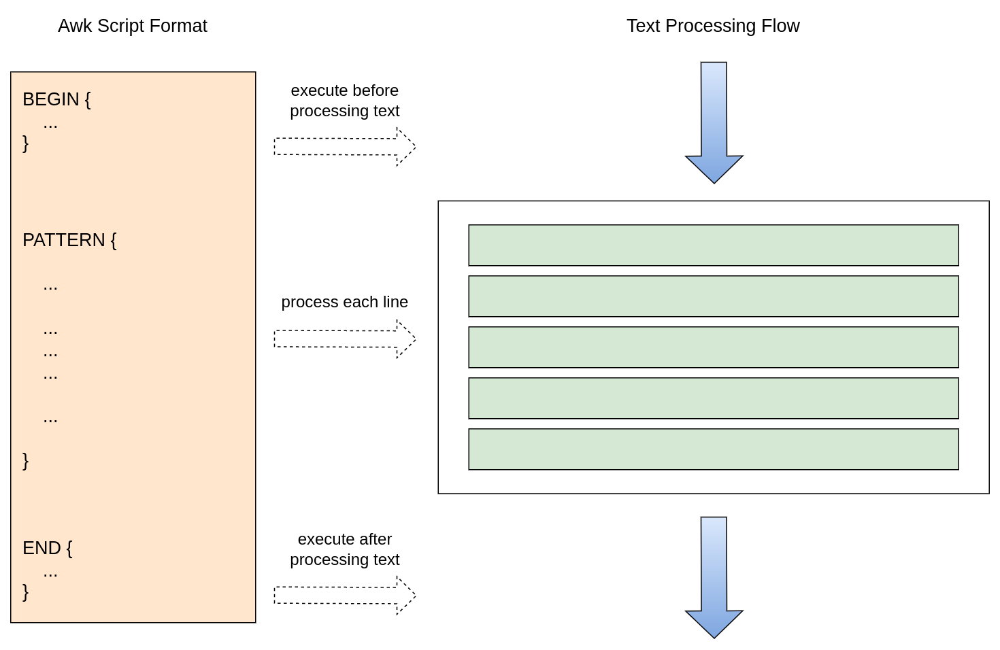

#### 1 Foreword
Awk is one of the most powerful data processing engines available in Linux and Unix environments. It provides extremely powerful functions: regular expression matching, mathematical operators, control flow statements, process control statements, and even built-in variables and functions. You can see that it has almost all the elegant features that a complete language should have. In fact, awk is a programming language hidden in the command line. With it, we can easily realize data sorting, data processing, report generation and many other powerful functions.
#### 2 Working Principle
As shown in the figure below, the awk script consists of three parts, corresponding to the three steps of text processing. Among them, the BEGIN code block will be executed before processing the text, the intermediate code block is used to process the text line matched by the pattern expression, and the END code block can perform some operations after the text is processed. These three parts are optional, no matter which code block is missing, the remaining code blocks will be executed according to the text processing flow.


#### 3 Basic Usage
The awk script can be directly passed to the awk command through parameters, as shown below, the file path to be processed needs to be specified.
```shell
$ awk 'BEGIN{}pattern{commands}END{}' {text file}
```
If the script is more complicated, you can also store the script in a file separately, and then use the -f parameter to specify the location of the script file.
```shell
$ awk -f {script file} {text file}
```
#### 4 Built-in Variable
| Built-in Variable | Meaning |
| --- | --- |
| $0 | Entire line |
| $1-$n | Fields 1-n of the current line |
| NF | The number of fields in the current row, that is, how many columns there are |
| NR | The line number of the current line, counting from 1 |
| FNR | When processing multiple files, the line number of each file is counted separately, starting from 0 |
| FS | Enter the field separator, if not specified, it will be separated by space or tab key by default |
| RS | Enter the line separator, the default is carriage return and line feed |
| OFS | Output field separator, default is space |
| ORS | Output line separator, the default is carriage return and line feed |

Suppose we have the following test data:
```shell
$ cat demo1.txt
Name Gender Age Education
John Male 25 Bachelor
Mike Male 34 Doctoral
Lily Female 26 Bachelor
David Male 29 Master
$ cat demo2.txt
Name,Gender,Age,Education
John,Male,25,Bachelor
Mike,Male,34,Doctoral
Lily,Female,26,Bachelor
David,Male,29,Master
```
(1) Only print the contents of columns 1 and 2 of the demo1 file.
```shell
$ awk '{print $1,$2}' demo1.txt
Name Gender
John Male
Mike Male
Lily Female
David Male
```
Note: Because there is no need to do some operations before and after processing the text, the BEGIN and END code blocks are omitted.

(2) Print the number of columns in each row of the demo1 file.
```shell
$ awk '{print NF}' demo1.txt
4
4
4
4
4
```
(3) Print the demo1 file and add a number in front of each line.
```shell
$ awk '{print NR,$0}' demo1.txt
1 Name Gender Age Education
2 John Male 25 Bachelor
3 Mike Male 34 Doctoral
4 Lily Female 26 Bachelor
5 David Male 29 Master
```
(4) Only print the contents of columns 1 and 3 of the demo2 file.
```shell
$ awk -F ',' 'BEGIN{OFS=","}{print $1,$2}' demo2.txt
Name,Gender
John,Male
Mike,Male
Lily,Female
David,Male
```
Note: Since the default column separator is a space, a new column separator needs to be specified before processing.
#### 5 Pattern Matching
Sometimes we don't need to process every line, but only certain lines. Awk provides a very powerful pattern matching tool, which can not only match through regular expressions, but also match through operators, or achieve more complex matching by combining the two. The list of available operators is listed below.

| Symbol Type | Symbol | Meaning |
| --- | --- | --- |
| Relational Operators | < | less than |
|  | > | greater than |
|  | <= | less than or equal to |
|  | >= | greater or equal to |
|  | == | equal |
|  | != | not equal to |
|  | ~ | match regular expression |
|  | !~ | does not match the regular expression |
| Logical Operators | && | and |
|  | &#124;&#124; | or |
|  | ! | not |

(1) Only print the lines containing Mike.
```shell
$ awk '/Mike/{print $0}' demo1.txt
Mike Male 34 Doctoral
```
(2) Only print the rows where the degree is undergraduate.
```shell
$ awk '$4=="Bachelor"{print $0}' demo1.txt
John Male 25 Bachelor
Lily Female 26 Bachelor
```
(3) Only print rows whose age is less than 30.
```shell
$ awk '$3<30{print $0}' demo1.txt
John Male 25 Bachelor
Lily Female 26 Bachelor
David Male 29 Master
```
(4) Only print the rows whose age is less than 30 and whose degree is not a bachelor's degree.
```shell
$ awk '$3<30&&$4!="Bachelor"{print $0}' demo1.txt
David Male 29 Master
```
#### 6 Control Flow Statement
Conditional statement format:
```shell
# conditional statement 1
if (condition) {
  ...
}
# conditional statement 2
if(condition) {
  ...
} else {
  ...
}
# conditional statement 3
if(condition 1) {
  ...
} else if(condition 2) {
  ...
} else {
  ...
}
```
Loop statement format:
```shell
# for loop example
for(i = 0; i < 100; i++) {
  ...
}
# while loop example
while(condition) {
  ...
}
# do-while loop example
do {
  ...
} while(condition)
```
(1) Calculate the average score of the following students, and only print the name and average score of the students whose average score is greater than 90.
```shell
$ cat demo3.txt
Michael 80 90 96 98
David 93 98 92 91
Emily 78 76 87 92
Sarah 86 89 68 92
Kevin 85 95 75 90
Jessica 78 88 98 100
$ cat demo.awk
{
  avg = ($2 + $3 + $4 + $5) / 4
  if (avg > 90) {
    print $1,avg
  }
}
$ awk -f demo.awk demo3.txt
Michael 91
David 93.5
Jessica 91
```
(2) Calculate the sum of 1+2+3+4+...+100, using for, while, and do-while loops respectively.
Use a for loop to achieve:
```shell
$ cat for.awk
BEGIN {
  for(i = 1; i <= 100; i++) {
    sum += i
  }
  print sum
}
$ awk -f for.awk
5050
```
Implemented using a while loop:
```shell
$ cat while.awk
BEGIN {
  while(i <= 100) {
    sum += i
    i++
  }
  print sum
}
$ awk -f while.awk
5050
```
Implemented using a do-while loop:
```shell
$ cat doWhile.awk
BEGIN {
  i = 1
  do {
    sum += i
    i++
  } while(i <= 100)
  print sum
}
$ awk -f while.awk
5050
```
#### 7 String Functions
| **Function** | **Explanation** | **Return Value** |
| --- | --- | --- |
| length(str) | Calculate string length | The length of the string |
| index(str1,str2) | Find the position of str2 in str1 | Position index, counting from 1 |
| tolower(str) | Convert string to lowercase | Converted lowercase string |
| toupper(str) | Convert string to uppercase | Converted uppercase string |
| substr(str,m,n) | Substring a string, starting from the m-th character and taking n characters | The intercepted substring |
| split(str,arr,fs) | Splits the string into substrings using the field separator fs and stores them in the array arr | The number of substrings after cutting |
| match(str,RE) | Searches for a substring that matches the regular expression RE in str and returns the position of the match | The matching position |
| sub(RE,RepStr,str) | Searches for the first substring that matches RE in str and replaces it with RepStr. Returns the number of replacements made (1 or 0) | The number of replacements |
| gsub(RE,RepStr,str) | Searches for all substrings that match RE in str and replaces them with RepStr. Returns the total number of replacements made | The number of replacements |

(1) Search for the occurrence of the string "ea" in the string "I have a dream".
```shell
$ awk 'BEGIN{str="I have a dream"; location=index(str,"ea"); print location}'
12
```
(2) Convert the string "Hadoop is a bigdata Framework" to all lowercase.
```shell
$ awk 'BEGIN{str="Hadoop is a bigdata Framework"; print tolower(str)}'
hadoop is a bigdata framework
```
(3) Search for the first digit of the string "I got 90 on the test".
```shell
$ awk 'BEGIN{str="I got 90 in the test"; location=match(str,/[0-9]/); print location}'
7
```
(4) Extract a substring from the string "I got 90 on the test" starting from the 3rd character and taking 6 characters.
```shell
$ awk 'BEGIN{str="I got 90 in the test"; print substr(str,3,6)}'
got 90
```
(5) Replace the first matched digit string in the string "I got 90 on the test" with the @ sign.
```shell
$ awk 'BEGIN{str="I got 90 in the test"; sub(/[0-9]+/,"@",str); print str}'
I got @ in the test
```
#### 8 Summarize
In this article, we have introduced the basic use of awk as a tool in detail, understood the working principle of awk, and known some areas it is good at. In fact, it is not accurate to describe awk as a command-line tool in the Linux environment. It is actually a programming language. It not only has built-in variables and functions, but also has flow control statements, and we can even customize variables and functions. Its syntax refers to the programming style of the C language, and it has powerful dynamic type deduction capabilities, so it is easier to program than shell scripts. Indeed, in many ways, awk scripts can be used to replace shell scripts to help us complete some automated things, so mastering awk well can effectively improve our work efficiency.

