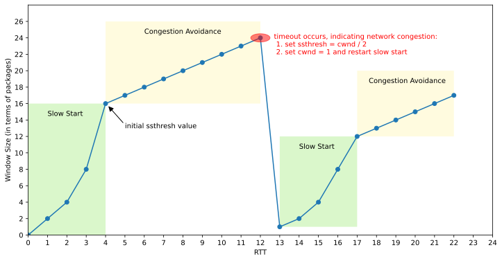
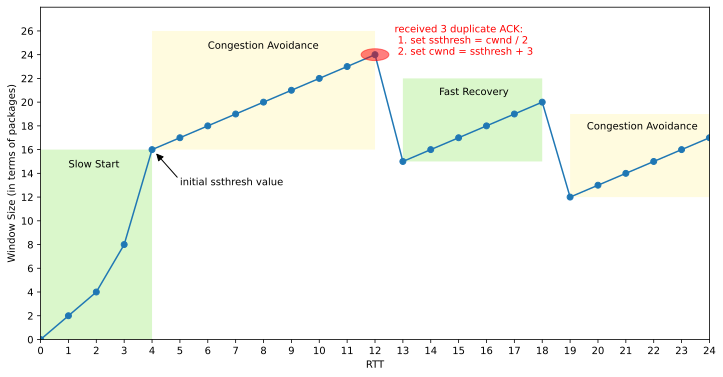
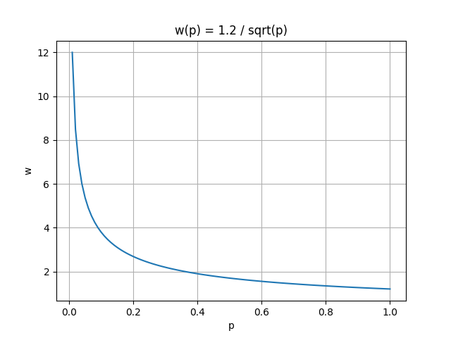
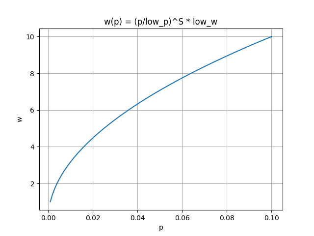
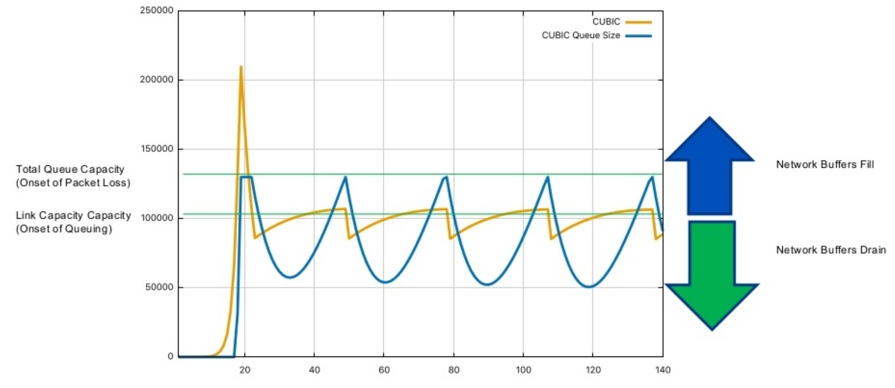
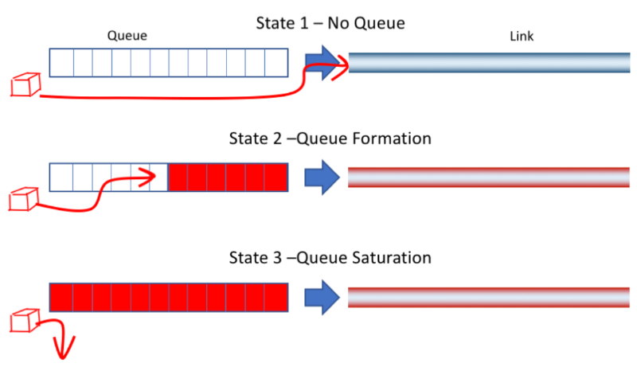
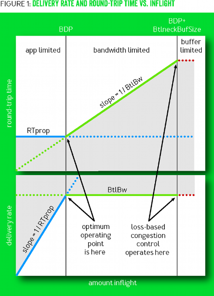
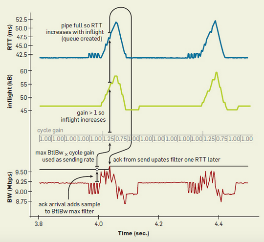
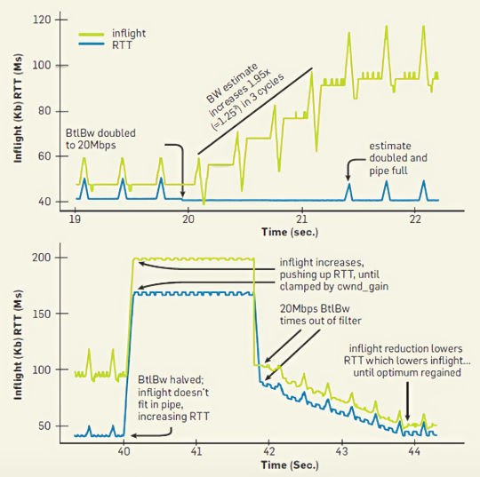

### 1 Background

TCP协议是一种可靠的网络传输协议，它通过超时重传来保证数据传输的可靠性，发送方在检测到丢包时会进行重传，从而确保接收方能够收到完整的数据。尽管看起来很美好，但现实环境往往更加复杂。 一般来说，发生丢包已经暗示网络出现过载，如果此时还在不断尝试重传，无疑会进一步加重网络负担，导致丢包更加频繁。 这反过来又加剧了超时重传，形成一种恶性循环，最终导致网络瘫痪，吞吐率急剧下降。为了应对这种情况，TCP引入了拥塞控制机制，其目标是根据网络环境动态调整发送方的发送速率，以最大化利用网络带宽，同时要确保大家都能分到公平的份额。

### 2 Basic Idea

为了控制发送速率，TCP使用了滑动窗口协议，发送方的实际窗口W的取值通过下面公式计算得到：
$$
W=min(awnd,\ cwnd) \notag
$$
其中，awnd是接收方的通告窗口大小，cwnd为拥塞窗口大小，实际窗口W取这两者中的较小值，这样就能同时兼顾接收方处理速率和网络传输速率。

接收方的通告窗口awnd的值可以从返回的ACK中获取，而拥塞窗口cwnd的值则需要我们动态地估计。拥塞控制算法的主要目标就是利用各种方法来估计cwnd的值。本文将详细讨论基于丢包和基于延迟的拥塞控制算法，并比较它们的优点和缺点。

优秀的拥塞控制算法需要同时满足以下关键要素:

- TCP友好性：当和其他使用不同拥塞控制算法的TCP连接共享网络带宽时，不会过度占用网络资源，要让其他连接也能获得公平的份额。
- RTT公平性：当和其他具有不同往返时延的TCP连接共享网络带宽时，不会过度的占用网络资源，要让其他连接也能获得公平的份额。
- 带宽利用率高：在保证上面两点的基础上，要尽可能的充分利用网络带宽，提高吞吐率。

### 3 基于丢包的算法

#### 3.1 Tahoe

Tahoe算法主要由三种机制组成：慢启动、拥塞避免和快速重传。 当连接最初建立时，将执行慢启动过程。 在此阶段，发送窗口 (cwnd) 随着往返时间 (RTT) 呈指数增长，直到超过慢启动阈值 (ssthresh)。 之后，进入拥塞避免阶段，发送窗口随着RTT线性增长，逐渐接近网络的拥塞阈值。 如果在此阶段发生数据包丢失（由于超时或快速重传），发送窗口将立即设置为 1，并且连接重新进入慢启动阶段。 在整个传输过程中，慢启动和拥塞避免过程不断交替，动态控制发送窗口大小。 下图说明了发送窗口大小如何随时间变化。



##### 3.1.1 慢启动

整个Slow Start流程可以总结如下：

- 将cwnd初始化为1，表示能够传输1个MSS大小的数据。
- 每当收到 ACK 时，设置 cwnd = cwnd + 1，导致线性增长。
- 每次往返时间(RTT)后，设置 cwnd = cwnd^2，导致指数增长。
- 设置慢启动阈值(ssthresh)，当 cwnd >= ssthresh 时，过渡到拥塞避免阶段。


##### 3.1.2 拥塞避免

拥塞避免阶段如下：

- 每当收到 ACK 时，设置 cwnd = cwnd + 1/cwnd。
- 每次 RTT 通过时，设置 cwnd = cwnd + 1，遵循线性增长模式。
- 如果发生超时丢包等情况，设置 sshthresh=cwnd/2，cwnd=1，进入慢启动阶段。


##### 3.1.3 状态机


##### 3.1.4 存在问题

- **全局同步问题**：在某些情况下，许多TCP连接可能会在相同的时间点经历丢包，导致所有的连接几乎同时进入慢启动阶段。这种现象被称为全局同步问题。它可能导致网络中的带宽利用率出现明显的周期性波动。
- **对单个丢包的反应过于剧烈**：在TCP Tahoe中，单个丢包会导致拥塞窗口大小减半，这可能过于剧烈。在某些网络环境中，丢包可能并不总是因为网络拥塞，因此，这种剧烈的反应可能导致不必要的性能下降。
- **对多个丢包的处理不佳**：TCP Tahoe在一个RTT内只能检测到一个丢包。如果在一个RTT内发生了多个丢包，TCP Tahoe可能需要多个RTT才能检测到所有的丢包。这可能导致拥塞窗口大小的调整过于缓慢，进一步降低了网络性能。

#### 3.2 Reno

如从上文所见，Tahoe算法在快速重传期间会将发送窗口设置为1，并启动慢启动阶段。我们知道，快速重传是由接收到三个重复的确认（ACK）引起的。由于可能会收到重复的ACK，这意味着网络状况并不那么糟糕。无需像超时丢包那样激烈地做出反应。在这种情况下，网络吞吐量将较低。因此，Reno算法提出了一种基于Tahoe算法的快速恢复机制。



##### 3.2.1 快速恢复

快速恢复阶段如下：

- 当收到重复的 ACK 时，设置 cwnd = cwnd + 1，继续快速恢复阶段。
- 当收到新的ACK时，设置 cwnd = sshthresh，进入拥塞避免阶段。
- 如果由于超时而丢包，则设置 sshthresh=cwnd/2，并设置 cwnd=1，进入慢启动阶段。

##### 3.2.2 状态机


##### 3.2.3 存在问题

- **同时出现多个丢包时的性能问题**：当同一窗口内丢失多个数据包时，可能会导致过早退出快速重传阶段，并导致CWND多次减少。 

  如下所示，当发送方收到3个重复的ACK时，触发丢失数据包的快速重传，进入快速恢复阶段。 此时，数据包3的ACK的到达被视为新的ACK，导致发送方将CWND减半并退出快速重传阶段，进入拥塞避免阶段。 然而，需要注意的是，数据包 3 也丢失了，因此发送方随后会收到数据包 3 的重复 ACK。这会导致发送方再次重传数据包 3，并重新进入快速重传阶段。 当多个数据包丢失时，这个过程可能会重复多次，导致整个过程中CWND迅速减少。


#### 3.3 NewReno

##### 3.3.1 基本介绍

NewReno是对Reno协议的改进，其主要优势在于能够检测并处理多个数据包的丢失，从而在处理多个数据包丢失的情况下，表现得比Reno更为高效。与Reno相似，NewReno在接收到三个重复数据包后会启动快速重传，但其与Reno的主要区别在于，NewReno会一直维持在快速恢复状态，直到所有未确认的数据包都得到确认，从而避免了Reno在快速恢复阶段可能出现的 cwnd 成倍降低的问题。

NewReno的快速重传阶段与Reno相同，但在快速恢复阶段，NewReno允许进行多次重传。每次NewReno进入快速恢复阶段，它都会记录下所有未确认的最大数据段。在快速恢复阶段，每当接收到新的ACK，NewReno会有两种可能的反应：

- 如果新的 ACK 确认了所有在快速恢复阶段开始时未确认的数据段，那么NewReno会退出快速恢复，将 cwnd 设置为 ssthresh，然后继续像Tahoe协议一样进行避免拥塞。

- 如果新的 ACK 只确认了部分数据段，那么NewReno会推断出队列中的下一个数据段已丢失，并重新传输该数据段，同时将重复ACK的数量重置为零。

只有当所有数据段都得到确认后，NewReno才会退出快速恢复阶段。

##### 3.3.2 存在问题

- **每一轮RTT只能检测一个丢包**：NewReno在收到重复ACK后，会立即重传丢失的数据包并等待其确认。由于每一个丢包的确认和重传都需要一个RTT。因此，如果一个窗口内发生了多个丢包，就会导致多个RTT的恢复时间，这在高丢包率的环境下严重影响了性能。

#### 3.4 SACK

##### 3.4.1 基本介绍

TCP SACK(Selective Acknowledgments) 是对 TCP Reno 的改进，它解决了 TCP Reno 和 TCP NewReno 所面临的问题，即在每个往返时间（RTT）内，能够识别并重新传输多个丢失的数据包。SACK 保留了 Reno 版本的慢启动和快速重传机制。在没有检测到数据包丢失的情况下，它还可以依靠 Tahoe 的粗粒度超时机制。

TCP SACK 协议规定，数据包的确认应该采用选择性而非累积性的方式。每个确认消息 (ACK) 都会携带一个字段，用于描述哪些数据段已经被接收方确认接收。这样，发送方就能够明确知道哪些数据段已被确认接收，哪些尚未得到确认。当发送方进入快速恢复模式时，会初始化一个名为pipe的变量，用于估计网络中尚未完成的包的数量，并将拥塞窗口cwnd设置为当前大小的一半。之后每次收到 ACK 时，pipe的值会减 1，而每次重新传输数据段时，pipe的值会增 1。当pipe的值小于拥塞窗口cwnd的值时，发送方会检查并发送尚未确认的数据段。如果没有待确认的数据段，发送方就会发送新的数据包。因此，一个 RTT 内可以重新发送多个丢失的数据段。

##### 3.4.2 存在问题

- **兼容性问题**：不是所有的TCP实现都支持SACK机制，通常拥塞控制只需要修改发送方就行，而SACK要求修改接收方的代码，这是一个庞大的工程。

#### 3.4 HSTCP

根据数学计算，标准 TCP 的拥塞窗口 w 和丢包率 p 存在某种约束关系，该关系的数学表达式为: $w(p) = 1.2/\sqrt{p}$ . 它的图像如下图所示:



可以看到当丢包率 p 不断增大的时候，拥塞窗口 w 会急剧的减小，也就是说随着拥塞窗口 w 的增大，丢包率 p 必须足够小才行，这使得标准 TCP 无法充分利用高带宽网络。假设当前带宽为 10Gbps， 往返时间为 100ms，每个包的字节数为 1500 byte。为了能充分利用带宽，拥塞窗口 w 要达到 83,333 segments。此时可以计算最大丢包率 $p = 1.5 / w^2  \approx 1/5,000,000,000$ , 也就是说发送 5000000000 个包最多只能丢一个包。可以计算丢包间隔时间 $S = ((1/p ÷ w) × 100) ÷ 1000 ≈ 6000s ≈ 1.7h$，也就是说至少隔 1.7 小时才能丢一个包，这显然是不可能的。

##### 3.4.1 修改响应函数

HSTCP算法通过修改响应函数 w(p) 减小了丢包率 p 对拥塞窗口 w 的影响，为此引入了下面四个参数:

- low_w: 表示最小窗口，只有大于最小窗口才使用 HSTCP 算法。

- low_p: 在最小窗口时的丢包率。

- high_w: 根据带宽来预估要达到的最大窗口。

- high_p: 预估在最大窗口时能接受的丢包率。

为了保证TCP友好性，HSTCP在窗口较小的情况下仍然保持和标准TCP一样的增长速率。

(1) 当 cwnd <= low_w 时, 使用标准TCP响应函数 $w(p) = 1.2/\sqrt{p}$ 。

(2) 当 cwnd > low_w 时, 使用修改后的响应函数 $w(p) = ({\Large \frac{p}{low\_p}})^S \times low\_w$ 。

这里有一个 S 参数，它的值通过下面公式计算得到:

$$
S = \frac{log(high\_w) - log(low\_w)}{log(high\_p) - log(low\_p)} \notag
$$

修改后的响应函数 w(p) 的曲线如下图所示:



从上图可以看到，当丢包率 p 上涨的时候，拥塞窗口 w 也随之增加，但增长的速率在不断减小。这意味着在高丢包率和高带宽的网络环境下，拥塞窗口依然能达到足够的高度，从而能够充分的利用网络资源。

##### 3.4.2 转成控制参数

修改了响应函数 w(p) 之后不能直接应用，还需要将其转成标准TCP形式的控制参数。标准TCP的窗口控制函数具有如下形式:

- 未出现拥塞事件的时候，cwnd 按照以下公式增加: $w = w + a(w)/w$
- 出现拥塞事件的时候，cwnd 按照以下公式减少: $w = w - b(w)*w$

在标准TCP中，a(w) 的值就固定为 1，b(w) 固定为 1/2。而现在，要把这两个参数做成动态可配置的，根据拥塞窗口 w 的大小分不同情况:

(1) 当 w <= low_w 时，a(w) 和 b(w) 还是和标准TCP保持一样，也就是: $a(w) = 1, \ b(w) = {\large \frac{1}{2}}$ 。

(2) 当 low_w < w < high_w 时，a(w) 和 b(w) 通过下面公式计算得到:

$$
\begin{aligned}
a(w) &= {\small W}^2 \times p(w) \times 2 \times {\frac{b(w)}{2-b(w)}} \\
b(w) &= (high\_decrease - 0.5) \times {\frac{log(w) - log(low\_w)}{log(high\_w) - log(low\_w)}}+ 0.5
\end{aligned} \notag
$$

(3) 当 w >= high_w 时，a(w) 和 b(w) 通过下面公式计算得到:

$$
\begin{aligned}
a(w) &= {high\_w}^2 \times high\_p \times 2 \times {\frac{b(w)}{2-b(w)}} \\
b(w) &= high\_decrease
\end{aligned} \notag
$$

其中 high_decrease 是一个可配置的常数。

##### 3.4.3 存在问题

- **存在RTT不公平现象**：因为HSTCP算法在RTT较大时采用更加激进的增长策略，这会挤占标准TCP链路的带宽，使其一直保持较低的带宽状态。

#### 3.5 BIC

BIC算法的基本思想是，理想窗口大小一定是在发生了丢包和未发生丢包的中间的某个位置，所以我们可以利用二分搜索的方法来快速的找到目标窗口的位置。这也就是BIC算法名称的由来。同时BIC还解决了HSTCP算法的RTT不公平现象。


##### 3.5.1 二分查找增加

首先设置最小窗口值，它的值可以是任意的当前没发生过丢包的窗口大小。然后凭经验设置一个会发生丢包的最大窗口值，已知最小窗口值不会发生丢包，而最大窗口值肯定会发生丢包，那么我们理想的窗口大小应该就在这两个值中间，这样就可以用二分查找来快速确定目标窗口大小。在增加窗口大小过程中，如果出现任何丢包，则可以将当前窗口视为新的最大值，并且丢包后减小的窗口大小可以视为新的最小值，然后在这两者之间重新寻找新的平衡点。

这种方法的基本原理是，因为网络在新的最大窗口附近产生了丢包，但在新的最小窗口附近不会产生丢包，因此，目标窗口大小必然位于这两个值的中间。我们使用二分搜索去查找目标窗口，当达到目标窗口大小后，如果没有出现丢包，则当前窗口大小变为新的最小值，并计算新的目标。使用更新后的最小值和最大值重复此过程，直到最大值和最小值之间的差值低于预设阈值，也被称为最小增量 $S_{min}$。

##### 3.5.2 加法增加

当前窗口和目标窗口的距离太大时，直接将当前窗口大小增加到目标窗口可能会给网络带来太大的压力。因此，这里引入了加法增加策略。简单说，就是在二分查找过程中，如果当前窗口和目标窗口的距离大于最大增量 $S_{max}$ 时，则不会在下一个RTT中直接将当前窗口增加至目标窗口，而是只增加 $S_{max}$ ，直到当前窗口和目标窗口的距离小于 $S_{max}$ ，才会直接将当前窗口大小增加至目标窗口大小。这样，在大幅减少窗口之后，该策略首先线性增加窗口，然后以对数方式增加。 这种结合了二分查找增加和加法增加的策略被称为二分增加策略。

##### 3.5.3 超过最大值后

随着当前窗口不断接近最大窗口，它们两者之间的距离不断变小，因为存在最小增量 $S_{min}$，所以当前窗口在某个时刻必然会超过最大窗口。这时候就需要重新设置最大窗口值，因为最大值是未知的，所以这里设置一个默认的最大值(一个大常数)，然后将当前窗口设置为最小值。这时候当前窗口可能距离目标中点会很远，如果按照二分增长的话，那么就会按照最大增量 $S_{max}$ 进行线性增加。因为现在处在上一次的饱和点附近，还不清楚网络有没有变好，所以这样子增加还是比较激进的。这里先采用慢启动策略，假设当前窗口为cwnd并且最大增量为$S_{max}$，那么慢启动过程在每一轮RTT中将以 cwnd + 1、cwnd + 2、cwnd + 4、...、cwnd + $S_{max}$ 的步长增加。通过慢启动的方式探测可用带宽，直到可以安全的将窗口增加 $S_{max}$ 。在慢启动过程之后，就切换为二分增加。

##### 3.5.4 快速收敛

在HSTCP算法中，具有较大窗口的流会占用更多的带宽，而较小窗口的流只能占用小量带宽。这对于小窗口的流来说显然是不公平的，为了纠正这种行为，BIC算法进行了调整。具体来说，就是在二分查找增加过程中，一旦窗口被缩小，就需要重新定义最大值和最小值 。如果新的最大值小于先前的最大值，这说明窗口正在经历下降趋势，可能存在新的连接加入当前网络。因此，我们必须重新调整最大值，使其与新的目标窗口保持一致，即设定为 (max_win-min_win)/2，并重新定义目标窗口。然后，可以继续应用标准的二分增加策略，这一方法被称为快速收敛。

##### 3.5.5 伪代码

如果没有出现丢包，那么拥塞窗口(cwnd)会以三种不同的方式增加：二分查找增加、加法增加和慢启动增长。具体增长过程如下：

```
if (cwnd < wmax)          // binary search OR additive
  bic_inc = (wmax - cwnd) / 2;
else                      // slow start OR additive
  bic_inc = cwnd - wmax;
if (bic_inc > Smax)       // additive
  bic_inc = Smax;
else if (bic_inc < Smin)  // binary search OR slow start
  bic_inc = Smin;
cwnd = cwnd + (bic_inc / cwnd);
```

如果发生丢包事件，那么会对当前窗口(cwnd)进行乘法减少。 这里有一个减少因子β，它用于将 cwnd 减少 (100×β)%。 具体减小过程如下:

```
if (cwnd < wmax) // fast convergence
  wmax = cwnd * (2-β) / 2;
else 
  wmax = cwnd;
cwnd = cwnd * (1-β);
```

##### 3.5.6 存在问题

- **公平性问题**：在较小RTT的情况下，BIC算法的窗口增速仍然过快，这会挤占标准TCP的带宽。

#### 3.6 CUBIC

CUBIC将现有的线性窗口增长修改为三次函数，该函数是关于时间的函数，这使得窗口的增长独立于RTT，也就是说不管你传输的是快还是慢，当前窗口增长都是按照时间来的，到什么时间就做什么事情。这样就完美的解决了RTT不公平性，在具有不同RTT的流之间实现更公平的带宽分配。


##### 3.6.1 实现细节

(1) 为了保证TCP友好性，如果当前窗口 cwnd 小于阈值 $W_{tcp(t)}$ ，就会使用 $W_{tcp(t)}$ 的值来更新当前窗口。 $W_{tcp(t)}$ 通过下面公式计算得到:
$$
W_{tcp(t)} =  W_{max}(1-\beta) + 3 \frac{\beta}{1+\beta} \frac{t}{RTT} \notag
$$

上面公式可以看出，$W_{tcp(t)}$ 其实是关于时间 t 的线性函数，也就是说拥塞窗口在较短的 RTT 中和标准 TCP 一样保持线性增长。

(2) 当拥塞窗口 cwnd > $W_{tcp(t)}$ 时，就会使用下面的三次函数来更新窗口大小。每当接收到一个新的ACK时，就会计算自上次窗口缩小以来经过的时间 t，然后将 t 代入下面公式计算得到当前窗口的值:

$$
W(t) = C \times (t-K)^3 + W_{max} \notag
$$

其中 C 表示缩放因子，是一个常数，$W_{max}$ 是上次窗口缩小之前的窗口大小，K 表示没有进一步丢包的情况下，将 cwnd 增加到 $W_{max}$ 所需的时间，K 在每次丢包事件发生后都会进行更新，并使用下面等式进行计算：

$$
K = \sqrt[3]{\frac{W_{max} \cdot \beta}{C}} \notag
$$

假设 C = 0.4，β = 0.2，将它们代入到公式中，那么 K 就等于下面的等式。

$$
K = \sqrt[3]{\frac{W_{max}}{2}} \notag
$$

如果 $W_{max}$ = 250，可以计算得出 K = 5s，假设 RTT = 100ms，那么增长到最大窗口 $W_{max}$ 就需要50个RTT。

(3) 如果发生了丢包事件，将当前窗口设置为最大值 $W_{max} = cwnd$ ，然后减少当前窗口 $cwnd = (1-\beta)cwnd$，然后进入快速恢复阶段。

在恢复时，使用下面公式更新 K :
$$
K = \sqrt{\frac{\beta \cdot W_{max}}{C}} \notag
$$

使用下面公式更新 $W_{max}$ :

$$
W_{max} = \beta \cdot W_{max} \notag
$$

##### 3.6.2 和Buffer的关系



上面这幅图中，黄色线表示拥塞窗口大小，蓝色线表示缓冲队列的包数，图中包含两根浅绿色的横线，其中较低的表示链路管道容量，而较高的表示链路的总容量。最开始时，黄线开始增长，但没有超过较低的绿线，此时缓冲队列没有产生堆积，所以蓝线一直保持为零。当黄线穿过较低的绿线之后，表明链路管道已经塞满，后面到来的包会放到缓冲队列中，这时候蓝线就会开始快速增长，直到蓝线抵达较高的绿线时，就表明缓冲队列已经满了，后面到来的包就会被丢弃。一旦出现丢包事件后，黄线就会开始快速下跌，当跌穿较高的绿线时，蓝线也开始跟着下跌，在下降到一定程度后，黄线会再次开始增长。此后，黄线将一直在较低的绿线附近波动，时而下降跌穿，时而上涨超越，而蓝线也跟着呈现周期性的上涨和下跌。不过值得注意的是，蓝线在波动过程中一直保持大于零的状态，这也说明了CUBIC会始终让缓冲队列保持一定数量的数据包。

##### 3.6.3 存在问题

- **无法快速响应网络情况**：CUBIC将大部分时间停留在 $W_{max}$ 附近，即使网络带宽发生变化，也需要经过一定的时间才能探测到。
- **链路延迟较大**：发生丢包后会将窗口大小降下来，但是又很快去逼近 $W_{max}$ ，没来得及等链路的Buffer全清空，Buffer又开始堆积，导致Buffer一直处于比较满的状态，这样就导致了整个链路的延迟增大。

### 4 基于延时的算法

#### 4.1 Vegas



在上图中，状态1表示没有缓冲队列没有发生堆积，整个链路比较通畅。状态2表示缓冲队列产生轻微堆积，此时延迟会增大，但还没有出现丢包情况。状态3表示缓冲队列已经塞满，这时就开始出现丢包现象。前面介绍的基于丢包的算法都是在状态3这个时候才开始采取措施的，但是最优的操作时间点应该是状态2这个时候。Vegas算法的目标就在状态2的时候采取措施，以降低网络拥塞，并减少丢包重传现象。实验证明，与Reno相比，Vegas的吞吐量可以提高40%到70%，而重新传输的数据量仅为Reno的20%到50%。

##### 4.1.1 新的重传机制

在Reno中，往返时间(RTT)和方差估计是使用粗粒度计时器(约500毫秒)计算的，这意味着RTT估计不是非常准确。这种粗粒度影响了计算本身的准确性，以及TCP多久检查一次是否应该在一个段上超时。Reno不仅在发生粗粒度超时时重传，还在接收到3个重复的ACK时重传。当Reno收到无法确认的新数据时，它会发送一个重复的ACK，因为它尚未接收到所有先前的数据。

Vegas通过以下方式扩展了Reno的重传机制。

1. 首先，每次发送一个包时，Vegas都会读取并记录系统时钟。
2. 当收到一个ACK时，Vegas再次读取时钟，并使用此时间和记录的相关段的时间戳进行RTT计算。
3. 然后，Vegas使用这个更准确的RTT估计来决定在以下两种情况下是否进行重传。

Vegas重传有两种情况:

- 当收到重复的ACK时，Vegas会检查当前时间与记录的相关段的时间戳之间的差异是否大于超时值。如果是的话，Vegas会立即重传该段，而无需等待3个重复的ACK。在许多情况下，丢失要么非常严重，要么窗口非常小，以至于发送方永远不会收到三个重复的ACK，因此Reno必须依赖上述提到的粗粒度超时。
- 当收到非重复的ACK时，如果它是在重传之后的第一个或第二个ACK，Vegas会再次检查自发送该段以来的时间间隔是否大于超时值。如果是的话，Vegas会重新传输该段。这将捕捉到在重传之前可能已经丢失的任何其他段，而无需等待重复的ACK。

换句话说，Vegas将接收到特定ACK视为触发检查超时是否应该发生的条件。如果这些机制未能识别丢失的段，它仍然包含Reno的粗粒度超时代码。

##### 4.1.2 拥塞避免机制

Reno是一种被动的拥塞控制算法，它依赖丢包事件来作为网络拥塞的信号，这种设计导致它无法在网络拥塞的初期阶段，也就是在发生丢包之前采取预防措施。因此，为了找到连接的可用带宽，Reno必须通过引发丢包来进行测量和调整。

Vegas算法通过测量吞吐率来调整窗口大小，它利用的简单思想是：传输中的字节数和预期的吞吐量是成正比的。因此，随着窗口大小的增加，传输中的字节数也随之增加，从而带宽的吞吐量应该相应增加。

Step1: 首先初始化连接的基本往返时间(BaseRTT)。在实际应用中，一般设置为所有测得的往返时间的最小值。

Step2: 计算预期吞吐率：Expected = WindowSize / BaseRTT。其中 WindowSize 是当前拥塞窗口的大小。

Step3: 计算实际吞吐率：Actual = transmittedBytes / transmittedRTT。这个计算每个往返时间执行一次。

Step4: 计算预期吞吐率和实际吞吐率的差值：Diff = Expected - Actual。通过该差值来相应的调整窗口大小。这里定义两个阈值 α < β，窗口调整策略如下:

- 当 Diff < α 时，在接下来的往返时间内线性增加拥塞窗口。
- 当 Diff > β 时，在接下来的往返时间内线性减小拥塞窗口。
- 当 α < Diff < β 时，保持拥塞窗口不变。

请注意，当实际吞吐率大于预期吞吐率时我们需要将 BaseRTT 更改为最新采样的 RTT。

##### 4.1.3 修改的慢启动机制

Vegas预期随着网络带宽的增加，慢启动的预期丢失也会相应增加。为了能够在慢启动期间检测和避免拥塞，Vegas只允许每隔一个往返时间进行指数增长。在此期间，拥塞窗口保持固定，以便进行有效的预期和实际速率的比较。当实际速率下降到预期速率以下一定量时，称为y阈值时，Vegas从慢启动模式切换到线性增加/减少模式。

##### 4.1.4 存在问题

- **无法充分利用网络带宽**：Vegas算法的拥塞窗口 cwnd 也是线性增长的，所以和标准TCP一样，无法充分的利用大的网络带宽。
- **无法和基于丢包的算法共存**：因为Vegas一旦探测到了RTT增大，就会减慢自己的发送速率，而此时并没有发生丢包事件，所以基于丢包的算法不会降低发送速率。因此，在和基于丢包的算法共享网络带宽时，Vegas很可能会被挤出去。

#### 4.3 BBR

在传统的基于丢包的算法中，默认将产生丢包和网络出现拥塞对应了起来，但是随着高速网络的发展，这种对应关系可能并不牢靠。就像前面介绍的一样，随着拥塞窗口的增大，势必会导致丢包率的上升。因此，我们不能仅仅以丢包的发生作为判断网络拥塞的唯一依据。为了更好的利用网络带宽，我们首先需要弄清楚真正的网络瓶颈在哪里，下图展示了BBR算法对网络带宽在不同阶段的限制的阐述。



在上图中，上半部分显示的是 RTT 随着 inflight 包的变化，而下半部分显示的是传送率随着 inflight 包的变化。其中蓝色的线表示的是 RTprop 的变化，绿色的线表示的是 BtlBw 的变化，红色的线表示整条链路的缓冲区瓶颈。整幅图从左到右可以分为三个区域，分别为: app limited，bandwidth limited, buffer limited。

- app limited：此时还没有足够的包填充满数据管道，因此吞吐率受应用本身的限制，这时 RTprop 的数值固定，而 BtlBw 呈线性增长。
- bandwidth limited：此时虽然数据包填满了管道容量，但还没有填满缓冲队列，因此吞吐率受管道带宽的限制，这时 BtlBw 的数值固定，而 Rtprop 呈线性增长。
- buffer limited：这时数据包已经把缓冲队列都填满了，从这之后就会开始出现丢包了，因此吞吐率受到缓冲区大小的限制。

传统的基于丢包的算法都是在buffer limited阶段进行优化的，而BBR算法认为最佳的优化时间点应该是在bandwidth limited阶段。

##### 4.3.1 探测指标

(1) RTprop(round-trip propagation time)

RTprop指的是当前链路最小的往返时间，它是当前链路的物理属性，只有在连接路径发生变化时才会变化。它和RTT是不一样的，它们之间的关系可以用下面等式表示:

$$
RTT_t = RTprop_t + \eta_t \notag
$$

上面等式中 $\eta_t$ 永远是大于 0 的，它表示沿路径产生的噪声，比如接收方的延迟 ACK 策略、ACK 聚合等，这些都会导致往返时间延长。RTT 我们是可以测量得到的，但是噪声如何计算呢？我们可以计算在一段窗口内最小的 RTT，并用它来作为 RTprop 的估计值。

$$
\widehat{RTprop} = RTprop_t + min(\eta_t) = min(RTT_t) \notag
$$


(2) BtlBw(bottleneck bandwidth)

BtlBw 表示当前链路的瓶颈带宽，也可以说是管道容量，超过这个值之后，再发送的包就会被放入缓冲队列，这样就会增加链路的往返时间。BtlBw 的估计值可以通过下面等式计算:

$$
\widehat{BtlBw} = max(deliveryRate_t) \notag
$$

上面的 deliveryRate 可以通过传输数据除以 RTT 得到。

##### 4.3.2 状态机

采用 BBR 进行拥塞控制的流在任一时刻都是处于以下四个状态之一: Startup、Drain、ProbeBW和ProbeRTT。其中 ProbeBW 属于稳态，其他三个状态都是暂态。下面是四个状态的转移图：


**(1) Startup**

Startup是BBR算法的初始阶段。为了尽快确定链路的瓶颈带宽（BtlBw），BBR算法以指数级方式增加发送速率。在此过程中，inflight 包的数量迅速增加，而往返时延（RTT）保持不变，因此deliveryRate也快速增加。当某一时刻deliveryRate不再继续增长时，BBR测量到的瓶颈带宽BtlBw也达到峰值。此时，BBR退出Startup状态，进入Drain状态。

**(2) Drain**

Drain阶段的目标就是快速排干在 Startup 阶段在缓冲队列中堆积的包。此时发送速率会设置成Startup阶段的倒数，指数级的降低当前发送速率，当 BBR 观察到 inflight 包的数量和 BDP 估计值差不多的时候，就会退出Drain状态，进入ProbeBW 状态，之后会周期性的在 ProbeBW 和 ProbeRTT 两个状态之间进行切换，间歇性的探测 BtlBw 和 RTprop。

**(3) ProbeBW**

在 ProbeBW 状态下，一般将循环周期划分为八个阶段，如 [1.25, 0.75, 1, 1, 1, 1, 1, 1]。首先执行增周期，将发送率提高至稳定期的 1.25 倍，直至出现丢包或 inflights 数据量达到 1.25 倍 BDP。观察延迟是否升高，若延迟升高而 deliveryRate 保持不变，则表明链路带宽未变，但发生了队列堆积。接着进入减周期，将发送率降至稳定期的 0.75 倍，等待一个 RTprop 或者直到 inflights 数据量低于 BDP，使链路上在增周期中出现的队列堆积得以清空。随后，保持 inflights 等于 BDP 稳定数个 RTprop，再次启动增周期。

**(4) ProbeRTT**

在除了ProbeRTT状态以外的状态下，如果超过10秒钟没有更新RTprop的估计值，就会进入到 ProbeRTT状态，在这个状态下，会将当前窗口cwnd减少到一个非常小的值，用来排干队列堆积的包，这样可以减少延迟，以便于测量出RTprop。在维持这个状态一段时间后，会转移到Startup或者ProbeBW状态，取决于它是否估计出链路已经被填满。

##### 4.3.3 工作过程

下图显示了一个10Mbps带宽，延迟40ms网络下的数据，其中蓝色的线表示RTT，绿色的线表示inflight包的数量，红色的线表示deliveryRate。红线上方的黑线是当前估计出来的BtlBw。在黑线上方的cycle gain用于控制发送速度，发送方当前发送速率的值为 cycle gain * BtlBw。BBR会周期性的将 cycle gain 设置为大于1，这将提高inflight包的数量，如果链路上的BtlBw没发生变化，增加的inflight包将会堆积到缓冲队列，从而导致RTT增大，这个过程会持续一个RTprop。随后会将 cycle gain 的值设置为小于1，此时将减少inflight包的数量，之前在缓冲队列堆积的包将被快速清空，RTT也会随之减小，这个过程同样持续一个RTprop。随后，cycle gain 将恢复为1，保持稳定数个RTprop。整个过程会周期性地执行，使曲线呈现脉冲状波动。



下图上半部分显示的是带宽从10Mbps提升到20Mbps的过程，下半部分是带宽从20Mbps下降到10Mbps的过程。在接近20秒的时刻，链路上的带宽突然增大，随后RTT有一些轻微的下降，然后inflight包的数量急剧下降。这时BBR探测到带宽增加了，于是相应的提高了发送速率。在接下来的3个周期里，inflight包的数量不断上升，而RTT依然保持不变，直至出现第一个小高峰。在此时，BBR算法探测到管道已经达到饱和，于是停止了发送速率的进一步增大。

在接近40秒的时刻，链路上的带宽突然减小。由于BBR维护了一个滑动窗口来存放探测到的BtlBw，并从窗口内选择最大值作为当前链路的BtlBw。因此即使带宽发生突降，BBR依然使用之前探测到的BtlBw的值，所以不会马上降低发送速率。此时inflight包的数据量快速增加，并开始堆积到缓冲队列中，从而导致RTT也大幅增加。但是BBR限制了inflight包的数据量不能超过cwnd_gain×BDP，所以带宽减小后inflight包不会无限增长上去，而是维持在一个固定的值，在图中表现为 40s ~ 42s之间的一条水平线。从42秒开始，之前BtlBw的最大值从采样窗口中滑出，BBR根据过去的一段时间重新计算BtlBw的值，并使用这个重新计算的BtlBw来调整发送速率。所以这时候发送速率会大幅的下滑，而inflight包的数量和RTT也都会逐渐减小，最终会达到一个稳定状态。



##### 4.3.4 存在问题

- **公平性问题**：当BBR算法和传统的基于丢包的算法共存时，BBR流量可能会占据大部分的带宽，导致其他流量得不到公平的带宽分配。
- **对于RTT的依赖**：BBR算法依赖于往返时间RTT来估计带宽，但在某些网络环境下，RTT可能会有较大的波动，这可能会影响BBR的性能。
- **长尾效应**：当网络流量减少时，由于BBR的带宽估计可能滞后于实际情况，它可能继续以过高的速率发送数据，进而引发网络拥塞。只有当BBR的带宽估计降至适当水平时，这种情况才会得到改善。
