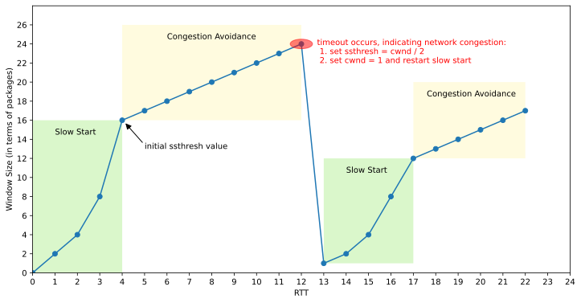
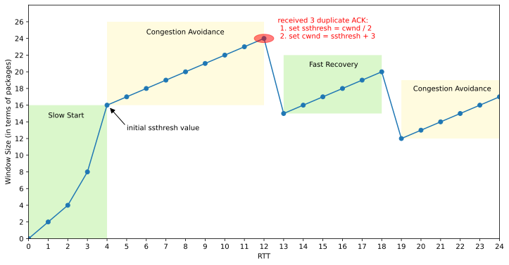

#### 1 Background

The TCP protocol is a reliable network transmission protocol. To ensure the reliability of data transmission, the sender will initiate retransmissions when it detects packet loss. This ensures that the receiver receives complete data, and the entire process is automated, making everything seem ideal. However, without proper control, it can lead to catastrophic consequences. Imagine that in general, packet loss may indicate that the network is already overloaded, meaning it's congested. If continuous retransmission attempts are made at this point without control, it will undoubtedly further burden the network, leading to more frequent packet losses. This, in turn, exacerbates the retransmission issue. At this point, the entire network falls into a vicious cycle, ultimately leading to paralysis.

#### 2 Basic Idea

To prevent this situation, the TCP protocol employs a congestion control mechanism with the goal of dynamically adjusting the sending rate of the TCP sender based on the network's congestion condition. This allows us to maintain a balanced network environment with high throughput, low latency, and low packet loss simultaneously. Prior to this, the sliding window protocol allowed the sender to adjust its window size based on the value of the receiver's advertised window (awnd) to keep up with the processing rate. Now, we introduce a variable called the congestion window (cwnd), which estimates the current network's optimal capacity and continuously adapts based on the degree of congestion in the network. At this point, the sender's actual window value (W) should be the minimum of these two, as represented by the following formula:
$$
W=min(cwnd，awnd)
$$

The advertised window can be obtained from the returned ACK header information, but how can we obtain the value of the congestion window? We can consider gradually applying pressure to the network to explore its optimal capacity. Initially, the congestion window takes a small value, and then, with each consecutive ACK received, it increases in size. If packet loss occurs, it likely indicates network congestion, so the congestion window is reduced at that point. This way, the congestion window value is continuously adjusted based on changes in the network environment. At the same time, when the advertised window (awnd) is sufficiently large, the sender's actual window size is determined by the congestion window size. This allows the sending rate to dynamically adapt to the network environment.

The premise of congestion control algorithms is to determine when congestion is occurring. The simplest way is to discern congestion based on packet loss, but more sophisticated methods involve assessing delays or having network routers collaborate to report congestion, which is known as explicit congestion notification. However, the latter method is not yet widespread due to the need for updates across a large number of routers globally. This article introduces several common congestion control algorithms, compares the differences between them, and aims to enhance the understanding of the congestion control process in the TCP protocol.

#### 3 Loss-Based Algorithms

##### 3.1 Tahoe

The Tahoe algorithm primarily consists of three mechanisms: Slow Start**, **Congestion Avoidance, and Fast Retransmit. When a connection is initially established, the Slow Start process is executed. During this phase, the sending window (cwnd) grows exponentially with the round-trip time (RTT) until it exceeds the Slow Start threshold (ssthresh). Afterward, it enters the Congestion Avoidance phase, where the sending window grows linearly with the RTT, progressively approaching the network's congestion threshold. If packet loss occurs during this phase, either due to a timeout or Fast Retransmit, the sending window is immediately set to 1, and the connection re-enters the Slow Start phase. Throughout the entire transmission process, Slow Start and Congestion Avoidance processes alternate continuously to dynamically control the sending window size. The diagram below illustrates how the sending window size changes over time.

**(1) Slow Start**

The entire Slow Start process can be summarized as follows:

- Initialize the cwnd with a value of 1, indicating the ability to transmit data of one MSS size.
- Whenever an ACK is received, set cwnd = cwnd + 1, leading to linear growth.
- After each round-trip time (RTT), set cwnd = cwnd^2, leading to exponential growth.
- Set the slow start threshold (ssthresh), when cwnd >= ssthresh, transition into the congestion avoidance phase.

**(2) Congestion Avoidance**

The congestion avoidance phases are as follows:

- Whenever an ACK is received, set cwnd = cwnd + 1/cwnd.
- Every time an RTT passes, set cwnd = cwnd + 1, following a linear growth pattern.
- In the event of a timeout and packet loss, set sshthresh =  cwnd / 2, and cwnd = 1, entering the slow start phase.

**(3) State Machine**

**(5) Problems**

The problem with Tahoe is that it take a complete timeout interval to detect a packet loss and in fact, in most implementations it takes even longer because of the coarse grain timeout. Also since it dosen't send immediate ACK's, it sends cumulative acknowledgements, there fore it follows a 'go-back-n' approach. Thus every time a packet is lost it waits for a timeout and the pipeline is emptied. This offers a major cost in high band-width delay product links.

##### 3.2 Reno

As can be seen from the above, the Tahoe algorithm will set the send window to 1 and start the slow start phase during fast retransmission. We know that fast retransmission is caused by receiving three duplicate ACKs. Since duplicate ACKs can be received, it means that the network situation is not that bad. There is no need to react as violently as timeout packet loss. In this case, the network throughput will be lower. Therefore, the Reno algorithm proposes a fast recovery mechanism based on the Tahoe algorithm.

**(1) Fast Recovery**

The fast recovery phases are as follows:

- When a duplicate ACK is received, set cwnd = cwnd + 1, continuing in the fast recovery phase.
- When a fresh ACK is received, set cwnd = sshthresh, entering the congestion avoidance phase.
- If packet loss occurs due to timeout, then set sshthresh =  cwnd / 2, and set cwnd = 1, and enters the slow start phase.

**(2) State Machine**

**(3) Problems**

The biggest challenge with the Reno algorithm is that when multiple packets are lost within the same window, it can lead to premature exit from the fast retransmit phase and result in multiple reductions in CWND. As shown below, when the sender receives 3 duplicate ACKs, it triggers a fast retransmiss-ion of the lost packet and enters the fast recovery phase. At this point, the arrival of an ACK for packet 3 is treated as a new ACK, causing the sender to halve CWND and exit the fast retransmit phase, entering the congestion avoidance phase. However, it's important to note that packet 3 is also lost, so the sender subsequently receives duplicate ACKs for packet 3. This leads to the sender retransmitting packet 3 again and re-entering the fast retransmit phase. When multiple packets are lost, this process may repeat several times, resulting in a rapid reduction in CWND throughout the entire process.

##### 3.3 NewReno

NewReno is a slight modification over Reno. It is able to detect multiple packet losses and thus is much more efficient that Reno in the event of multiple packet losses. Like Reno, NewReno also enters into fast-retransmit when it receives 3 duplicate packets, however it differs from Reno in that it doesn't exit fast-recovery until all the data which was out standing at the time it entered fast-recovery is acknowledged. Thus it overcomes the problem faced by Reno of reducing the CWD multiples times.

The fast-retransmit phase is the same as in Reno. The difference in the fast-recovery phase which allows for multiple re-transmissions is NewReno. Whenever NewReno enters fast-recovery it notes the maximums segment which is outstanding. The fast-recovery phase proceeds as in Reno, however when a fresh ACK is received then there are two cases:

- If it ACK's all the segment which were outstanding when we entered fast-recovery then it exits fast recovery and sets CWD to ssthresh and continues congestion avoidance like Tahoe.

- If the ACK is a partial ACK then it deduces that the next segment in line was lost and it re-transmits that segment and sets the number of duplicate ACKs received to zero.

It exit fast-recovery when all the data in the window is acknowledged.

**Problems:**

NewReno suffers from the fact that its take one RTT to detect each packet loss. When the ACK for the first re-transmitted segment is received only then can we deduce which other segment was lost.

##### 3.4 SACK

TCP with 'Selective Acknowledgments' is an extension of TCP Reno and it works around the problems face by TCP Reno and TCP NewReno, namely detection of multiple lost packets, and re-transmission of more than one lost packet per RTT. It retains the slow-start and fast-retransmit parts of Reno. It also has the coarse grained timeout of Tahoe to fall back on, incase a packet loss is not detected by the modified algorithm.

SACK TCP requires that segments not be acknowledged cumulatively but should be acknowledged selectively. Thus each ACK has a block which describes which segments are being acknowledged. Thus the sender has a picture of which segments have been acknowledged and which are still outstanding. Whenever the sender enters fast-recovery, it initializes a variable pipe which is an estimate of how much data is outstanding in the network, and it also set CWND to half the current size. Every time it receives an ACK it reduces the pipe by 1 and every time it re-transmits a segment it increments it by 1. Whenever the pipe goes smaller than the CWD window it checks which segments are un received and send them. If there are no such segments outstanding then it sends a new packet. Thus more than one lost segment can be sent in one RTT.

**Problems:**

The biggest problem with SACK is that currently selective acknowledgements are not provided by the receiver to implement SACK we'll need to implement selective acknowledegment which is not a very easy task.

##### 3.4 HSTCP

根据数学计算，标准TCP的拥塞窗口w和丢包率p存在某种约束关系，该关系的数学表达式为: $w = 1.2/\sqrt{p}$ . 也就是说随着拥塞窗口w的增大，丢包率p必须足够小才行，这使得标准TCP无法充分利用高带宽网络。假设当前带宽为10Gbps， 往返时间为100ms，每个包的字节数为1500 byte。为了能充分利用带宽，拥塞窗口w要达到 83,333 segments。此时可以计算最大丢包率 $p = 1.5 / w^2  \approx 1/5,000,000,000$, 这意味着在发送的50亿个数据包中，最多只能允许丢失一个数据包。此外，还可以计算丢包间隔时间 $S = ((1/p ÷ w) × 100) ÷ 1000 ≈ 6000s ≈ 1.7h$，也就是说至少隔1.7小时才能丢一个包，这显然是不可能的。

HighSpeed TCP is designed to solve the bandwidth bottleneck problem in high-speed networks, It use three parameters: Low_w, High_w and High_p. To ensure TCP compatibility:

- when cwnd <= Low_w, Use Standard TCP response function
- when cwnd > Low_w, Use HighSpeed response function
- Low_w is set to 38 MSS-sized segments, corresponding to a packet drop rate of $10^{-3}$ for TCP.

W = (p/Low_p)^S Low_w

未出现拥塞事件的时候，cwnd按照以下公式增加:

w = w + a(w)/w

出现拥塞事件的时候，cwnd按照以下公式减少：

w = (1 - b(w))w

当 w <= Low_Window时，和标准TCP一样，a(w) = 1 并且 b(w) = 1/2

当 w = High_Window时，

a(w) = High_Window^2 * High_P * 2 * b(w)/(2-b(w))

##### 3.5 BIC

什么是RTT公平性:

Large windows with a short RTT can always grow faster than small windows with a long RTT.

HSTCP and STCP are extremely scalable under low loss rates and TCP friendly under high loss rates. But they are not RTT fair.

##### 3.6 CUBIC

对BIC算法的改进，改进了BIC某些情况下增长过快的不足。

On detection via duplicate ACKs:

$W_{max} = cwnd$

$ssthresh = max(2, \ cwnd * \beta)$

$cwnd = cwnd * \beta$

On detection via a timeout, it is the same except for cwnd:

cwnd = RW = min(cwnd, IW)

#### 4 Delay-Based Algorithms

##### 4.1 Vegas

Vegas is a TCP implementation which is a modification of Reno. The experiments demonstrate that, compared to Reno, Vegas can increase throughput by 40% to 70%, and the amount of retransmitted data is only 20% to 50% of the Reno.

**(1) New Retransmission Mechanism**

In Reno, round trip time(RTT) and variance estimates are computed using a coarse-grained timer (around 500 ms), meaning that the RTT estimate is not very accurate. This coarse granularity influences both the accuracy of the calculation itself, and how often TCP checks to see if it should time out on a segment. Reno not only retransmits when a coarse-grained timeout occurs, but also when it receices 3 duplicate ACKs. Reno sends a duplicate ACK whenever it receives new data that it cannot acknowledge because it has not yet received all the previous data.

Vegas extends Reno's retransmission mechanisms as follows. First, Vegas reads and records the system clock each time a segment is sent. When an ACK arrives, Vegas reads the clock again and does the RTT calculation using this time and the timestamp recorded for the relevant segment. Vegas then uses this more accurate RTT estimate to decide to retransmit in the following two situations:

- When a duplicate ACK is received, Vegas checks to see if the difference between the current time and the timestamp recorded for the relevant segment is greater than the timeout value. If it is, then Vegas retransmits the segment without having to wait for 3 duplicate ACKs. In many case, losses are either so great or the window so small that the sender will never receive three duplicate ACKs, and therefore, Reno would have to rely on the coarse-grained timeout mentioned above.
- When a non-duplicate ACK is received, if it is the first or second one after a retansmission, Vegas again checks to see if the time interval since the segment was sent is larger than the timeout value. If it is, then Vegas retransmits the segment. This will catch any other segment that may have been lost previous to the retransmission without having to wait for a duplicate ACK.

In other words, Vegas treats the receipt of certain ACKs as a trigger to check if a timeout should happen. It still contains Reno's coarse-grained timeout code in case these mechanisms fail to recognize a lost segment.

**(2) Congestion Avoidance Mechanism**

TCP Reno's congestion detection and control mechanism uses the loss of segments as a signal that there is congestion in the network. It has no mechanism to detect the incipient stages of congestion--before losses occur--so they can be prevented. Reno is reactive, rather than proactive, in this respect. As a result, Reno needs to create losses to find the available bandwidth of the connection. 

Vegas' approach is most similar to Tri-S, in that it looks at changes in the throughput rate. However, it differs from Tri-S in that it calculates throughputs differently, and instead of looking for a change in the throughput slope, it compares the measured throughput rate with the expected throughput rate. The simple idea that Vegas exploits is that the number of bytes in transit is directly proportional to the expected throughput, and therefore, as the window size increases -- causing the bytes in transit to increase -- the throughput of connection should also increase.

Step1: Define a given connection's BaseRTT to be the RTT of a segment when the connection is not congested. In practice, Vegas sets BaeRTT to the minimum of all measured round trip times.

Step2: Calculates the expected throughput: Expected = WindowSize / BaseRTT. where WindowSize is the size of the current congestion window, which we assume for the purpose of this discussion, to be equal to the number of bytes in transmit.

Step3: Calculates the current actual sending rate: Actual = transmittedBytes / transmittedRTT. This calculation is done once per round-trip time.

Step4: Compares Actual to Expected, and adjusts the window accordingly. Let Diff = Expected - Actual. Note that Diff is positive or zero by definition, since Actual > Expected implies that we need to change BaseRTT to the latest sampled RTT. Also define two thresholds, α < β, roughly corresponding to having too little and too much extra data in the network, respectively:

- when Diff < α, increases the congestion window linearly during the next RTT.

- when Dif > β, decreases the congestion window linearly during the next RTT. 

- when α < Diff < β, leaves the congestion window unchanged.

**(3) Modified Slow-Start Mechanism**

Vegas expects that as network bandwidth increases, the expected loss of slow-start will similarly increase. To be able to detect and avoid congestion during slow-start, Vegas allows exponential growth only every other RTT. In between, the congestion window stays fixed so a valid comparison of the expected and actual rates can be made. When the actual rate falls below the expected rate by a certain amount, call this the y threshold, Vegas changes from slow-start mode to linear increase/decrease mode.

##### 4.2 WestWood

##### 4.3 BBR

ProbeBW

ProbeRTT

问题: 基于丢包的算法与BBR算法竞争可能会被挤出去
