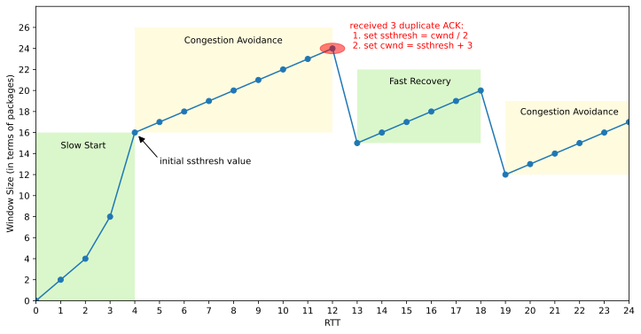
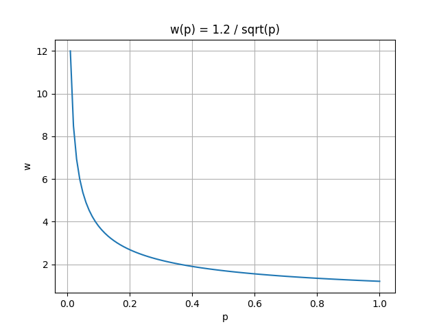
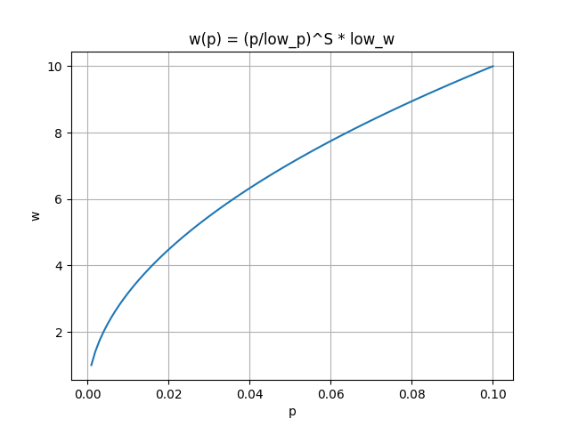
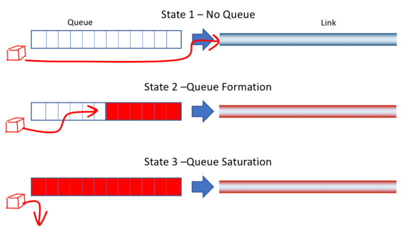
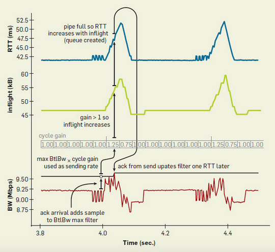
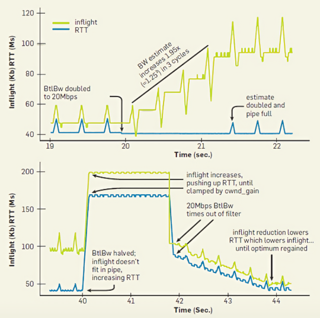

### 1 Background

The TCP protocol is a reliable network transmission protocol, which ensures the reliability of data transmission through timeout retransmissions. The sender will retransmit upon detecting packet loss, thereby ensuring that the receiver can receive complete data. Although this seems ideal, the real-world environment is often more complex. Generally speaking, packet loss implies network overload. If retransmission attempts continue at this time, it will undoubtedly further increase the network burden, leading to more frequent packet loss. This, in turn, exacerbates timeout retransmissions, forming a vicious cycle that ultimately leads to network paralysis and a sharp drop in throughput. To address this situation, TCP introduces a congestion control mechanism. Its goal is to dynamically adjust the sender's transmission rate based on the network environment, to maximize the use of network bandwidth, while also ensuring that everyone gets a fair share.

### 2 Basic Idea

In order to control the transmission rate, TCP uses the sliding window protocol. The actual window size W of the sender is calculated using the following formula:

$$
W=min(awnd,\ cwnd) \notag
$$

Where, awnd is the advertised window size of the receiver, and cwnd is the congestion window size. The actual window W takes the smaller of the two, which can take into account both the processing rate of the receiver and the transmission rate of the network.

The value of the receiver's advertised window awnd can be obtained from the returned ACK, while the value of the congestion window cwnd needs to be dynamically estimated. The main goal of the congestion control algorithm is to use various methods to estimate the value of cwnd. This article will discuss in detail the congestion control algorithms based on packet loss and delay, and compare their advantages and disadvantages.

An excellent congestion control algorithm needs to satisfy the following key elements simultaneously:

- TCP friendliness: When sharing network bandwidth with other TCP connections using different congestion control algorithms, it should not excessively occupy network resources and should allow other connections to also get a fair share.
- RTT fairness: When sharing network bandwidth with other TCP connections with different round-trip delays, it should not excessively occupy network resources and should allow other connections to also get a fair share.
- High bandwidth utilization: While ensuring the above two points, it should make full use of network bandwidth as much as possible to improve throughput.

### 3 Loss-Based Algorithms

#### 3.1 Tahoe

The Tahoe algorithm primarily consists of three mechanisms: slow start, congestion avoidance, and fast retransmit. When a connection is initially established, the slow start process is executed. During this phase, the congestion window (cwnd) grows exponentially with each round-trip time (RTT) until it exceeds the slow start threshold (ssthresh). Afterward, it enters the congestion avoidance phase, where the sending window grows linearly with each RTT, gradually approaching the network's congestion threshold. If packet loss occurs during this phase (due to a timeout or fast retransmit), the sending window is immediately set to 1, and the connection re-enters the slow start phase. Throughout the transmission process, the slow start and congestion avoidance processes alternate continuously, dynamically controlling the size of the sending window. The following diagram illustrates how the size of the sending window changes over time.


##### 3.1.1 Slow Start

The entire Slow Start process can be summarized as follows:

- Initialize cwnd to 1, indicating that it can transmit data of 1 MSS (Maximum Segment Size).
- Whenever an ACK is received, set cwnd = cwnd + 1, leading to linear growth.
- After each round-trip time (RTT), set cwnd = cwnd^2, leading to exponential growth.
- Set a slow start threshold (ssthresh). When cwnd >= ssthresh, transition to the congestion avoidance stage.


##### 3.1.2 Congestion Avoidance

The congestion avoidance phase is as follows:

- Whenever an ACK is received, set cwnd = cwnd + 1/cwnd.
- After each RTT, set cwnd = cwnd + 1, following a linear growth pattern.
- If a timeout packet loss occurs, set ssthresh = cwnd/2, cwnd = 1, and enter the slow start phase.


##### 3.1.3 State Machine


##### 3.1.4 Problems

- **Global synchronization problem**: In some cases, many TCP connections may experience packet loss at the same time, causing all connections to enter the slow start phase almost simultaneously. This phenomenon is known as the global synchronization problem. It can lead to noticeable periodic fluctuations in the utilization of network bandwidth.
- **Overly dramatic reaction to a single packet loss**: In TCP Tahoe, a single packet loss can halve the congestion window size, which may be too dramatic. In some network environments, packet loss may not always be due to network congestion, so this dramatic reaction could lead to unnecessary performance degradation.
- **Poor handling of multiple packet losses**: TCP Tahoe can only detect one packet loss within an RTT. If multiple packet losses occur within an RTT, TCP Tahoe may need multiple RTTs to detect all packet losses. This could result in too slow adjustments of the congestion window size, further reducing network performance.

#### 3.2 Reno

As can be seen from the above, the Tahoe algorithm will set the send window to 1 and start the slow start phase during fast retransmission. We know that fast retransmission is caused by receiving three duplicate ACKs. Since duplicate ACKs can be received, it means that the network situation is not that bad. There is no need to react as violently as timeout packet loss. In this case, the network throughput will be lower. Therefore, the Reno algorithm proposes a fast recovery mechanism based on the Tahoe algorithm.



##### 3.2.1 Fast Recovery

The fast recovery phases are as follows:

- When a duplicate ACK is received, set cwnd = cwnd + 1, continuing in the fast recovery phase.
- When a fresh ACK is received, set cwnd = sshthresh, entering the congestion avoidance phase.
- If packet loss occurs due to timeout, then set sshthresh =  cwnd / 2, and set cwnd = 1, and enters the slow start phase.

##### 3.2.2 State Machine


##### 3.2.3 Problems

- **Performance issues when multiple packet losses occur simultaneously**: When multiple packets are lost within the same window, it may cause a premature exit from the fast retransmission phase and multiple reductions of CWND.

  As shown below, when the sender receives 3 duplicate ACKs, a fast retransmission of the lost packet is triggered, entering the fast recovery phase. At this point, the arrival of the ACK for packet 3 is considered a new ACK, causing the sender to halve CWND and exit the fast retransmission phase, entering the congestion avoidance phase. However, it should be noted that packet 3 is also lost, so the sender will subsequently receive a duplicate ACK for packet 3. This will cause the sender to retransmit packet 3 again and re-enter the fast retransmission phase. When multiple packets are lost, this process may be repeated multiple times, causing CWND to decrease rapidly throughout the process.

  

#### 3.3 NewReno

##### 3.3.1 Basic Concept

NewReno is an improvement over the Reno protocol, with its main advantage being able to detect and handle the loss of multiple packets, thereby performing more efficiently than Reno when dealing with multiple packet losses. Similar to Reno, NewReno initiates fast retransmission after receiving three duplicate packets, but the main difference is that NewReno stays in the fast recovery state until all unacknowledged packets have been acknowledged, thereby avoiding the potential problem of Reno's cwnd decreasing exponentially during the fast recovery phase.

The fast retransmission phase of NewReno is the same as Reno, but during the fast recovery phase, NewReno allows for multiple retransmissions. Each time NewReno enters the fast recovery phase, it records all the largest unacknowledged segments. During the fast recovery phase, whenever a new ACK is received, NewReno has two possible reactions:

- If the new ACK acknowledges all the unacknowledged segments at the start of the fast recovery phase, then NewReno will exit fast recovery, set cwnd to ssthresh, and then continue to avoid congestion like the Tahoe protocol.
- If the new ACK only acknowledges part of the segments, then NewReno will infer that the next segment in the queue has been lost, and retransmit that segment, while resetting the number of duplicate ACKs to zero.

Only when all segments have been acknowledged does NewReno exit the fast recovery phase.

##### 3.3.2 Problems

- **Only one packet loss can be detected per RTT round**: After NewReno receives a duplicate ACK, it immediately retransmits the lost packet and waits for its acknowledgment. Since each packet loss acknowledgment and retransmission requires one RTT, if multiple packet losses occur within a window, it will result in recovery times of multiple RTTs, which severely affects performance in high packet loss environments.

#### 3.4 SACK

##### 3.4.1 Basic Concept

TCP SACK (Selective Acknowledgments) is an improvement over TCP Reno, solving the problem faced by TCP Reno and TCP NewReno, which is the ability to identify and retransmit multiple lost packets within each round-trip time (RTT). SACK retains the slow start and fast retransmission mechanisms of the Reno version. In the absence of detected packet loss, it can also rely on Tahoe's coarse-grained timeout mechanism.

The TCP SACK protocol stipulates that the acknowledgment of packets should be selective rather than cumulative. Each acknowledgment message (ACK) carries a field describing which data segments have been confirmed by the receiver. In this way, the sender can clearly know which data segments have been confirmed and which have not yet been confirmed. When the sender enters fast recovery mode, it initializes a variable called pipe to estimate the number of unfinished packets in the network and sets the congestion window cwnd to half of its current size. Each time an ACK is received, the value of pipe is decreased by 1, and each time a data segment is retransmitted, the value of pipe is increased by 1. When the value of pipe is less than the value of the congestion window cwnd, the sender checks and sends unacknowledged data segments. If there are no data segments awaiting acknowledgment, the sender sends new packets. Therefore, multiple lost data segments can be retransmitted within one RTT.

##### 3.4.2 Problems

- **Compatibility issues**: Not all TCP implementations support the SACK mechanism. Typically, congestion control only requires modifications to the sender's code, while SACK requires modifications to the receiver's code, which is a major undertaking.

#### 3.5 HSTCP

According to mathematical calculations, there is a certain constraint relationship between the congestion window w of standard TCP and the packet loss rate p. The mathematical expression of this relationship is: $w(p) = 1.2/\sqrt{p}$. The graph of it is shown in the figure below.



It can be seen that as the packet loss rate p continues to increase, the congestion window w will sharply decrease. In other words, as the congestion window w increases, the packet loss rate p must be sufficiently small. This makes standard TCP unable to fully utilize high-bandwidth networks. Suppose the current bandwidth is 10Gbps, the round-trip time is 100ms, and the number of bytes per packet is 1500 bytes. In order to fully utilize the bandwidth, the congestion window w needs to reach 83,333 segments. At this time, the maximum packet loss rate can be calculated as:

$$
p = 1.5 / w^2  \approx 1/5,000,000,000 \notag
$$

which means that at most one packet can be lost for every 5,000,000,000 packets sent. The packet loss interval time can be calculated as:

$$
S = ((1/p ÷ w) × 100) ÷ 1000 ≈ 6000s ≈ 1.7h \notag
$$

which means that at least 1.7 hours must pass before a packet can be lost, which is clearly impossible.

##### 3.5.1 Modify Response Function

The HSTCP algorithm reduces the impact of the packet loss rate p on the congestion window w by modifying the response function w(p), introducing the following four parameters for this purpose:

- low_w: Represents the minimum window. The HSTCP algorithm is only used when it is greater than the minimum window.
- low_p: The packet loss rate at the minimum window.
- high_w: The maximum window to be reached is estimated based on the bandwidth.
- high_p: The acceptable packet loss rate at the maximum window is estimated.

To ensure TCP-friendliness, HSTCP still maintains the same growth rate as standard TCP when the window is small.

(1) When cwnd <= low_w, the standard TCP response function $w(p) = 1.2/\sqrt{p}$ is used.

(2) When cwnd > low_w, the modified response function $w(p) = ({\Large \frac{p}{low\_p}})^S \times low\_w$ is used.

Here, there is a parameter S, the value of which is calculated using the following formula:

$$
S = \frac{log(high\_w) - log(low\_w)}{log(high\_p) - log(low\_p)} \notag
$$

The curve of the modified response function w(p) is shown in the following figure:



From the figure above, it can be seen that when the packet loss rate p increases, the congestion window w also increases, but the rate of increase is constantly decreasing. This means that in a network environment with high packet loss rates and high bandwidth, the congestion window can still reach a sufficient height, thus making full use of network resources.

##### 3.5.2 Convert to Control Parameters

After modifying the response function w(p), it cannot be directly applied. It needs to be converted into control parameters in the form of standard TCP. The window control function of standard TCP has the following form:

- When no congestion event occurs, cwnd increases according to the following formula: $w = w + a(w)/w$
- When a congestion event occurs, cwnd decreases according to the following formula: $w = w - b(w)*w$

In standard TCP, the value of $a(w)$ is fixed at 1, and $b(w)$ is fixed at 1/2. Now, these two parameters need to be made dynamically configurable, according to the size of the congestion window $w$:

(1) When $w \leq low_w$, $a(w)$ and $b(w)$ remain the same as in standard TCP, which is: $a(w) = 1, \ b(w) = {\large \frac{1}{2}}$.

(2) When $low_w < w < high_w$, $a(w)$ and $b(w)$ are calculated by the following formulas:

$$
\begin{aligned}
a(w) &= {\small W}^2 \times p(w) \times 2 \times {\frac{b(w)}{2-b(w)}} \\
b(w) &= (high\_decrease - 0.5) \times {\frac{log(w) - log(low\_w)}{log(high\_w) - log(low\_w)}}+ 0.5
\end{aligned} \notag
$$

(3) When $w \geq high_w$, $a(w)$ and $b(w)$ are calculated by the following formulas:

$$
\begin{aligned}
a(w) &= {high\_w}^2 \times high\_p \times 2 \times {\frac{b(w)}{2-b(w)}} \\
b(w) &= high\_decrease
\end{aligned} \notag
$$

Here, $high\_decrease$ is a configurable constant.

##### 3.5.3 Problems

- **Existence of RTT Unfairness**: Because the HSTCP algorithm uses a more aggressive growth strategy when RTT is larger, it will squeeze the bandwidth of the standard TCP link, keeping it in a low bandwidth state.

#### 3.6 BIC

The basic idea of the Binary Increase Congestion (BIC) control algorithm is that the ideal window size must be at some position between when packet loss has occurred and when no packet loss has occurred. Therefore, we can use the binary search method to quickly find the position of the target window. This is the origin of the name of the BIC algorithm. At the same time, BIC also solves the RTT unfairness problem of the HSTCP algorithm.


##### 3.6.1 Binary Search Increase

First, set the minimum window size, which can be any current window size where no packet loss has occurred. Then, based on experience, set a maximum window size where packet loss will occur. Given that the minimum window size will not experience packet loss, while the maximum window definitely will, the ideal window size should be somewhere between these two values. This way, binary search can be used to quickly determine the target window size. During the process of increasing the window size, if any packet loss occurs, the current window can be considered as the new maximum, and the window size reduced after packet loss can be considered as the new minimum. Then, a new balance point can be found between these two.

The basic principle of this method is that because the network generates packet loss near the new maximum window, but does not generate packet loss near the new minimum window, the target window size must be between these two values. We use binary search to find the target window. When the target window size is reached, if no packet loss occurs, the current window size becomes the new minimum, and a new target is calculated. This process is repeated using the updated minimum and maximum values until the difference between the maximum and minimum values is below a preset threshold, also known as the minimum increment $S_{min}$.

##### 3.6.2 Additive Increase

When the distance between the current window and the target window is too large, directly increasing the current window size to the target window may put too much pressure on the network. Therefore, an additive increase strategy is introduced here. In simple terms, during the binary search process, if the distance between the current window and the target window is greater than the maximum increment $S_{max}$, then the current window will not be directly increased to the target window in the next RTT. Instead, it will only increase by $S_{max}$ until the distance between the current window and the target window is less than $S_{max}$. Only then will the current window size be directly increased to the target window size. In this way, after a large reduction in the window, this strategy first increases the window linearly, then increases logarithmically. This strategy, which combines binary search increase and additive increase, is called the Binary Increase strategy.

##### 3.6.3 After Exceeding the Maximum Value

As the current window continues to approach the maximum window, the distance between them keeps decreasing. Because there is a minimum increment $S_{min}$, the current window will inevitably exceed the maximum window at some point. At this time, it is necessary to reset the maximum window value. Since the maximum value is unknown, a default maximum value is set here (a large constant), and the current window is set to the minimum value. At this point, the current window may be far from the target midpoint. If it grows according to binary growth, it will increase linearly according to the maximum increment $S_{max}$. Because it is now near the saturation point of the last round, it is still unclear whether the network has improved, so this kind of increase is still quite aggressive. Here, the slow-start strategy is first adopted. Assuming the current window is cwnd and the maximum increment is $S_{max}$, then the slow-start process will increase in steps of cwnd + 1, cwnd + 2, cwnd + 4, ..., cwnd + $S_{max}$ in each RTT round. The available bandwidth is probed using the slow-start method until the window can be safely increased by $S_{max}$. After the slow-start process, it switches to binary increase.

##### 3.6.4 Fast Convergence

In the HSTCP algorithm, flows with larger windows will occupy more bandwidth, while flows with smaller windows can only occupy a small amount of bandwidth. This is obviously unfair to flows with smaller windows. To correct this behavior, the BIC algorithm makes adjustments. Specifically, during the binary search increase process, once the window is reduced, the maximum and minimum values need to be redefined. If the new maximum value is less than the previous maximum value, this indicates that the window is experiencing a downward trend, and there may be new connections joining the current network. Therefore, we must readjust the maximum value to keep it consistent with the new target window, that is, set it to (max_win-min_win)/2, and redefine the target window. Then, the standard binary increase strategy can be continued. This method is called fast convergence.

##### 3.6.5 Pseudocode

If no packet loss occurs, the congestion window (cwnd) will increase in three different ways: binary search increase, additive increase, and slow-start growth. The specific growth process is as follows:

```text
if (cwnd < wmax)          // binary search OR additive
  bic_inc = (wmax - cwnd) / 2;
else                      // slow start OR additive
  bic_inc = cwnd - wmax;
if (bic_inc > Smax)       // additive
  bic_inc = Smax;
else if (bic_inc < Smin)  // binary search OR slow start
  bic_inc = Smin;
cwnd = cwnd + (bic_inc / cwnd);
```

If a packet loss event occurs, a multiplicative decrease will be applied to the current window (cwnd). There is a reduction factor β, which is used to reduce cwnd by (100×β)%. The specific reduction process is as follows:

```text
if (cwnd < wmax) // fast convergence
  wmax = cwnd * (2-β) / 2;
else 
  wmax = cwnd;
cwnd = cwnd * (1-β);
```

##### 3.6.6 Problems

- **Fairness Issue**: In the case of smaller RTTs, the window increase speed of the BIC algorithm is still too fast, which will squeeze the bandwidth of standard TCP.

#### 3.7 CUBIC

CUBIC modifies the existing linear window growth to a cubic function, which is a function of time. This makes the window growth independent of RTT, meaning that no matter how fast or slow you transmit, the current window growth is based on time, doing what needs to be done at a specific time. This perfectly solves the RTT unfairness, achieving a more fair bandwidth allocation among flows with different RTTs.


##### 3.7.1 Algorithm Details

(1) To ensure TCP friendliness, if the current window size cwnd is less than the threshold $W_{tcp(t)}$, the value of $W_{tcp(t)}$ will be used to update the current window. $W_{tcp(t)}$ is calculated using the following formula:

$$
W_{tcp(t)} =  W_{max}(1-\beta) + 3 \frac{\beta}{1+\beta} \frac{t}{RTT} \notag
$$

As can be seen from the above formula, $W_{tcp(t)}$ is actually a linear function of time t, which means that the congestion window maintains linear growth in shorter RTTs, just like standard TCP.

(2) When the congestion window cwnd > $W_{tcp(t)}$, the following cubic function is used to update the window size. Every time a new ACK is received, the time t that has passed since the last window reduction is calculated, and then t is substituted into the following formula to calculate the current window value:

$$
W(t) = C \times (t-K)^3 + W_{max} \notag
$$

Where C represents the scaling factor and is a constant, $W_{max}$ is the window size before the last window reduction, and K represents the time required to increase cwnd to $W_{max}$ without further packet loss. K is updated after each packet loss event and is calculated using the following equation:

$$
K = \sqrt[3]{\frac{W_{max} \cdot \beta}{C}} \notag
$$

Assuming C = 0.4, β = 0.2, substituting them into the formula, then K equals the following equation.

$$
K = \sqrt[3]{\frac{W_{max}}{2}} \notag
$$

If $W_{max}$ = 250, it can be calculated that K = 5s. Assuming RTT = 100ms, then it takes 50 RTTs to grow to the maximum window $W_{max}$.

(3) If a packet loss event occurs, the current window is set to the maximum value $W_{max} = cwnd$, then the current window is reduced $cwnd = (1-\beta)cwnd$, and then it enters the fast recovery phase.

During recovery, K is updated using the following formula: 
$$
K = \sqrt[3]{\frac{\beta \cdot W_{max}}{C}} \notag
$$

$W_{max}$ is updated using the following formula:
$$
W_{max} = \beta \cdot W_{max} \notag
$$

##### 3.7.2 Relationship with Buffer


In the above graph, the yellow line represents the size of the congestion window, the blue line represents the number of packets in the buffer queue, and the graph contains two light green horizontal lines. The lower one represents the link pipeline capacity, and the higher one represents the total capacity of the link. At the beginning, the yellow line starts to grow, but does not exceed the lower green line. At this time, no accumulation occurs in the buffer queue, so the blue line remains zero. When the yellow line crosses the lower green line, it indicates that the link pipeline is full, and the packets that arrive later will be placed in the buffer queue. At this time, the blue line will start to grow rapidly until it reaches the higher green line, indicating that the buffer queue is full, and the packets that arrive later will be discarded.

Once a packet loss event occurs, the yellow line will start to fall rapidly. When it falls through the higher green line, the blue line also starts to fall. After falling to a certain extent, the yellow line will start to grow again. Afterward, the yellow line will always fluctuate near the lower green line, sometimes falling below and sometimes rising above it, and the blue line will also show periodic rises and falls. However, it is worth noting that the blue line always remains above zero during the fluctuation process, which also shows that CUBIC will always keep a certain number of data packets in the buffer queue.

##### 3.7.3 Problems

- **Inability to respond quickly to network conditions**: CUBIC spends most of its time around $W_{max}$, and it takes some time to detect changes in network bandwidth.
- **Large link latency**: After packet loss occurs, the window size is reduced, but it quickly approaches $W_{max}$ again. There is not enough time to wait for the link's buffer to be completely emptied, and the buffer starts to accumulate again, causing the buffer to be in a relatively full state, which leads to an increase in the overall link latency.

### 4 Delay-Based Algorithms

#### 4.1 Vegas



In the above graph, State 1 indicates that there is no accumulation in the buffer queue, and the entire link is relatively smooth. State 2 indicates a slight accumulation in the buffer queue, at which point latency increases, but packet loss has not yet occurred. State 3 indicates that the buffer queue is full, and packet loss begins to occur. The packet loss-based algorithms introduced earlier only start to take action at State 3, but the optimal operating point should be at State 2. The goal of the Vegas algorithm is to take action at State 2 to reduce network congestion and reduce the phenomenon of packet loss and retransmission. Experiments have shown that compared with Reno, the throughput of Vegas can be increased by 40% to 70%, and the amount of retransmitted data is only 20% to 50% of Reno.

##### 4.1.1 New Retransmission Mechanism

In Reno, round-trip time (RTT) and variance estimates are calculated using a coarse-grained timer (about 500 milliseconds), which means that RTT estimates are not very accurate. This coarse granularity affects the accuracy of the calculation itself, as well as how often TCP checks whether it should time out on a segment. Reno retransmits not only when a coarse-grained timeout occurs, but also when it receives three duplicate ACKs. When Reno receives new data that it cannot confirm, it sends a duplicate ACK because it has not received all previous data.

Vegas extends Reno's retransmission mechanism in the following way.

1. First, each time a packet is sent, Vegas reads and records the system clock.
2. When an ACK is received, Vegas reads the clock again and uses this time and the timestamp of the associated segment recorded for RTT calculation.
3. Then, Vegas uses this more accurate RTT estimate to decide whether to retransmit in the following two cases.

There are two cases of Vegas retransmission:

- When a duplicate ACK is received, Vegas checks whether the difference between the current time and the timestamp of the associated recorded segment is greater than the timeout value. If so, Vegas immediately retransmits the segment without waiting for three duplicate ACKs. In many cases, the loss is either very severe or the window is so small that the sender will never receive three duplicate ACKs, so Reno must rely on the aforementioned coarse-grained timeout.
- When a non-duplicate ACK is received, if it is the first or second ACK after retransmission, Vegas checks again whether the time interval since the segment was sent is greater than the timeout value. If so, Vegas retransmits the segment. This will capture any other segments that may have been lost before the retransmission, without waiting for duplicate ACKs.

In other words, Vegas treats the receipt of a specific ACK as a trigger to check whether a timeout should occur. If these mechanisms fail to identify lost segments, it still includes Reno's coarse-grained timeout code.

##### 4.1.2 Congestion Avoidance Mechanism

Reno is a passive congestion control algorithm that relies on packet loss events as signals of network congestion. This design prevents it from taking preventive measures in the early stages of network congestion, i.e., before packet loss occurs. Therefore, in order to find the available bandwidth of a connection, Reno must measure and adjust by causing packet loss.

The Vegas algorithm adjusts the window size by measuring throughput. The simple idea it uses is that the number of bytes in transmission is proportional to the expected throughput. Therefore, as the window size increases, the number of bytes in transmission also increases, and the bandwidth throughput should increase correspondingly.

Step1: First, initialize the basic round-trip time (BaseRTT) of the connection. In practical applications, it is generally set to the minimum of all measured round-trip times.

Step2: Calculate the expected throughput: Expected = WindowSize / BaseRTT. Here, WindowSize is the current size of the congestion window.

Step3: Calculate the actual throughput: Actual = transmittedBytes / transmittedRTT. This calculation is performed once per round-trip time.

Step4: Calculate the difference between the expected throughput and the actual throughput: Diff = Expected - Actual. The window size is adjusted accordingly based on this difference. Here, two thresholds are defined: α < β. The window adjustment strategy is as follows:

- When Diff < α, the congestion window is linearly increased in the next round-trip time.
- When Diff > β, the congestion window is linearly decreased in the next round-trip time.
- When α < Diff < β, the congestion window is kept unchanged.

Please note that when the actual throughput is greater than the expected throughput, we need to change the BaseRTT to the most recently sampled RTT.

##### 4.1.3 Modified Slow Start Mechanism

Vegas anticipates that with the increase in network bandwidth, the expected loss during slow start will also increase correspondingly. In order to detect and avoid congestion during the slow start period, Vegas only allows exponential growth every other round-trip time. During this period, the congestion window remains fixed to allow for effective comparisons of expected and actual rates. When the actual rate drops a certain amount below the expected rate, called the y threshold, Vegas switches from slow start mode to linear increase/decrease mode.

##### 4.1.4 Problems

- **Unable to fully utilize network bandwidth**: The congestion window cwnd of the Vegas algorithm also grows linearly, so like standard TCP, it cannot fully utilize large network bandwidth.
- **Unable to coexist with loss-based algorithms**: Once Vegas detects an increase in RTT, it slows down its sending rate. At this point, no packet loss event has occurred, so loss-based algorithms will not reduce their sending rate. Therefore, when sharing network bandwidth with loss-based algorithms, Vegas is likely to be squeezed out.

#### 4.2 BBR

In traditional loss-based algorithms, packet loss is assumed to correspond to network congestion by default. However, with the development of high-speed networks, this correspondence may not be reliable. As introduced earlier, as the congestion window increases, the packet loss rate will inevitably rise. Therefore, we cannot solely rely on packet loss as the only basis for judging network congestion. To better utilize network bandwidth, we first need to understand where the real network bottleneck is. The following diagram illustrates the BBR algorithm's explanation of network bandwidth limitations at different stages.


In the diagram above, the top half shows the change in RTT with the variation in inflight packets, while the bottom half shows the change in throughput with the variation in inflight packets. The blue line represents the change in RTprop, the green line represents the change in BtlBw, and the red line represents the buffer bottleneck of the entire link. The entire diagram can be divided into three areas from left to right, namely: app limited, bandwidth limited, and buffer limited.

- App limited: At this point, there are not enough packets to fill the data pipeline, so the throughput is limited by the application itself. At this time, the value of RTprop is fixed, and BtlBw grows linearly.
- Bandwidth limited: At this point, although the pipeline capacity is filled with packets, the buffer queue is not filled yet. Therefore, the throughput is limited by the pipeline bandwidth. At this time, the value of BtlBw is fixed, and RTprop grows linearly.
- Buffer limited: At this point, the packets have filled up the buffer queue, and packet loss will start to occur from this point onwards. Therefore, the throughput is limited by the buffer size.

Traditional loss-based algorithms optimize at the buffer limited stage, while the BBR algorithm believes that the optimal optimization point should be at the bandwidth limited stage.

##### 4.3.1 Probing Metrics

(1) RTprop (round-trip propagation time)

RTprop refers to the current link's minimum round-trip time. It is a physical property of the current link and only changes when the connection path changes. It is different from RTT (Round Trip Time), and their relationship can be expressed by the following equation:

$$
RTT_t = RTprop_t + \eta_t \notag
$$

In the above equation, $\eta_t$ is always greater than 0. It represents the noise generated along the path, such as the delay ACK strategy of the receiver, ACK aggregation, etc., which will cause the round-trip time to extend. We can measure RTT, but how do we calculate the noise? We can calculate the minimum RTT within a window and use it as an estimate of RTprop.

$$
\widehat{RTprop} = RTprop_t + min(\eta_t) = min(RTT_t) \notag
$$

(2) BtlBw (bottleneck bandwidth)

BtlBw represents the bottleneck bandwidth of the current link, which can also be said to be the pipeline capacity. Any packets sent after exceeding this value will be put into the buffer queue, which will increase the round-trip time of the link. The estimated value of BtlBw can be calculated by the following equation:

$$
\widehat{BtlBw} = max(deliveryRate_t) \notag
$$

The above deliveryRate can be obtained by dividing the transmitted data by the RTT.

##### 4.3.2 State Machine

A flow using BBR for congestion control is in one of the following four states at any given time: Startup, Drain, ProbeBW, and ProbeRTT. Among them, ProbeBW is a steady state, while the other three states are transient. Below is the transition diagram of the four states:


**(1) Startup**

Startup is the initial phase of the BBR algorithm. In order to quickly determine the bottleneck bandwidth (BtlBw) of the link, the BBR algorithm increases the sending rate exponentially. During this process, the number of inflight packets increases rapidly, while the round-trip delay (RTT) remains unchanged, so the deliveryRate also increases rapidly. When the deliveryRate no longer continues to grow at some point, the bottleneck bandwidth BtlBw measured by BBR also reaches its peak. At this point, BBR exits the Startup state and enters the Drain state.

**(2) Drain**

The goal of the Drain phase is to quickly drain the packets accumulated in the buffer queue during the Startup phase. At this time, the sending rate is set to the reciprocal of the Startup phase, exponentially reducing the current sending rate. When BBR observes that the number of inflight packets is roughly the same as the BDP estimate, it will exit the Drain state and enter the ProbeBW state. Afterwards, it will periodically switch between the ProbeBW and ProbeRTT states, intermittently probing BtlBw and RTprop.

**(3) ProbeBW**

In the ProbeBW state, the cycle is generally divided into eight stages, such as [1.25, 0.75, 1, 1, 1, 1, 1, 1]. First, the increase period is executed, raising the sending rate to 1.25 times that of the steady state, until packet loss occurs or the inflights data volume reaches 1.25 times BDP. Observe whether the delay increases. If the delay increases while the deliveryRate remains unchanged, it means that the link bandwidth has not changed, but there is queue accumulation. Then it enters the decrease period, reducing the sending rate to 0.75 times that of the steady state, waiting for an RTprop or until the inflights data volume is less than BDP, so that the queue accumulation that occurred during the increase period on the link can be cleared. Subsequently, keep inflights equal to BDP for a steady number of RTprops, and then start the increase period again.

**(4) ProbeRTT**

In states other than the ProbeRTT state, if the estimate of RTprop is not updated for more than 10 seconds, it will enter the ProbeRTT state. In this state, the current window cwnd will be reduced to a very small value to drain the packets accumulated in the queue, which can reduce the delay and facilitate the measurement of RTprop. After maintaining this state for a period of time, it will transition to the Startup or ProbeBW state, depending on whether it estimates that the link has been filled.

##### 4.3.3 Working Process

The following figure shows data for a network with a bandwidth of 10Mbps and a delay of 40ms. The blue line represents RTT, the green line represents the number of inflight packets, and the red line represents deliveryRate. The black line above the red line is the currently estimated BtlBw. The cycle gain above the black line is used to control the sending speed, and the current sending rate of the sender is cycle gain * BtlBw. BBR will periodically set the cycle gain to be greater than 1, which will increase the number of inflight packets. If the BtlBw on the link does not change, the increased inflight packets will accumulate in the buffer queue, leading to an increase in RTT. This process will last for one RTprop. Subsequently, the value of cycle gain will be set to less than 1, which will reduce the number of inflight packets. The packets previously accumulated in the buffer queue will be quickly cleared, and RTT will also decrease. This process will also last for one RTprop. Subsequently, the cycle gain will return to 1 and remain stable for several RTprops. The entire process will be executed periodically, causing the curve to show pulse-like fluctuations.



The upper part of the following figure shows the process of bandwidth increasing from 10Mbps to 20Mbps, and the lower part shows the process of bandwidth decreasing from 20Mbps to 10Mbps. At around 20 seconds, the bandwidth on the link suddenly increases, then the RTT has a slight drop, followed by a sharp drop in the number of inflight packets. At this point, BBR detects that the bandwidth has increased, so it correspondingly increases the sending rate. In the next three cycles, the number of inflight packets continues to rise, while the RTT remains unchanged, until the first small peak appears. At this point, the BBR algorithm detects that the pipeline has reached saturation, so it stops further increasing the sending rate.

At around 40 seconds, the bandwidth on the link suddenly decreases. Since BBR maintains a sliding window to store the detected BtlBw, and selects the maximum value from the window as the current BtlBw of the link, even if the bandwidth drops suddenly, BBR still uses the previously detected BtlBw value, so it will not immediately reduce the sending rate. At this time, the amount of inflight packet data increases rapidly and begins to accumulate in the buffer queue, which leads to a significant increase in RTT. However, BBR limits the amount of inflight packet data to not exceed cwnd_gain×BDP, so after the bandwidth decreases, the inflight packets will not grow indefinitely, but will maintain a fixed value, which is shown as a horizontal line between 40s ~ 42s in the figure. Starting from 42 seconds, the previous maximum value of BtlBw slides out of the sampling window. BBR recalculates the value of BtlBw based on the past period of time, and uses this recalculated BtlBw to adjust the sending rate. So at this time, the sending rate will drop sharply, and the number of inflight packets and RTT will gradually decrease, eventually reaching a stable state.



##### 4.3.4 Problems

- **Fairness issue**: When the BBR algorithm coexists with traditional loss-based algorithms, BBR traffic may occupy most of the bandwidth, leading to unfair bandwidth allocation for other traffic.
- **Dependence on RTT**: The BBR algorithm relies on Round-Trip Time (RTT) to estimate bandwidth. However, in some network environments, RTT may fluctuate significantly, which could affect BBR's performance.
- **Long tail effect**: When network traffic decreases, BBR's bandwidth estimation might lag behind the actual situation, and it may continue to send data at an excessively high rate, thereby causing network congestion. This situation will only improve when BBR's bandwidth estimation drops to an appropriate level.

### 5 References

>[1] “A Comparative Analysis of TCP Tahoe, Reno, New-Reno, SACK and Vegas.” 
>
>[2] S. Floyd, M. Handley, and J. Padhye, “A comparison of equation-based and AIMD congestion control,” 2000.
>
>[3] “BBR: Congestion-Based Congestion Control - ACM Queue.” Accessed: Dec. 31, 2023. [Online]. Available: https://queue.acm.org/detail.cfm?id=3022184
>
>[4] L. Xu, K. Harfoush, and I. Rhee, “Binary Increase Congestion Control for Fast, Long Distance Networks”.
>
>[5] V. Jacobson, “Congestion Avoidance and Control”.
>
>[6] L. Xu, S. Ha, I. Rhee, V. Goel, and L. Eggert, “CUBIC for Fast and Long-Distance Networks,” Internet Engineering Task Force, Request for Comments RFC 9438, Aug. 2023. doi: 10.17487/RFC9438.
>
>[7] S. Ha, I. Rhee, and L. Xu, “CUBIC: a new TCP-friendly high-speed TCP variant,” SIGOPS Oper. Syst. Rev., vol. 42, no. 5, pp. 64–74, Jul. 2008, doi: 10.1145/1400097.1400105.
>
>[8] S. Floyd, “HighSpeed TCP for Large Congestion Windows,” Internet Engineering Task Force, Request for Comments RFC 3649, Dec. 2003. doi: 10.17487/RFC3649.
>
>[9] V. R. P. DRAFT, “Modifying TCP’s Congestion Control for High Speeds,” 2002.
>
>[10] A. Gurtov, T. Henderson, and S. Floyd, “The NewReno Modification to TCP’s Fast Recovery Algorithm,” Internet Engineering Task Force, Request for Comments RFC 3782, Apr. 2004. doi: 10.17487/RFC3782.

