#### 1. 前言

在计算机领域，正则表达式是一个名副其实的神器，它的诞生可以说是直接推动了计算机软件的发展进程。到目前为止它已经在编译器，搜索引擎，文本处理等多个领域中有着广泛的应用，并且仍在持续的探索着许多未知的可能性。对于普通使用者而言，熟练的掌握好正则表达式能够有效的提高我们的工作效率，改善我们的生活品质。可是面对形如天书般的正则语法，不少人对此望而却步。本文将从正则表达式原理出发，让读者能够对正则表达式语法产生直观的印象，后续我们通过亲自动手打造一个正则引擎，来加深对正则表达式的理解。

#### 2. 什么是语言？

我们平时说的语言是由一个个句子所构成的，其中的每个句子都是由字符组成的排列组合。对于英文来说，这些字符来自字母表，而对于中文来说，这些字符则取自汉字表。无论是字母表还是汉字表，它们都是有限的字符集合，基于这些字符集合，构成了纷繁多样的语言世界。我们可以进一步的进行抽象概括，语言就是某个给定字母表上一个任意的可数的字符串集合，其中给定的字母表是一个有限的符号集合，而字符串是该字母表中符号的一个有穷序列。例如，计算机指令是由{0, 1}这样的二进制字母表所组成的有穷序列，而计算机语言就是由这些计算机指令所构成的集合。基于这种抽象，我们可以针对语言做一些代数运算。在此之前，我们先来看一下字符串的运算。

假设 x 和 y 都是字符串，x 和 y 的连接操作就是把 y 附加到 x 后面所形成的串。例如，如果 x = dog 且 y = house，那么 xy = doghouse。假设 $\epsilon$ 是空串，那么对于任何字符串 $s$ 都有，$s{\epsilon} = {\epsilon}{s}=s$。如果把两个串的连接看成是这两个串的"乘积"，我们可以定义串的"指数"运算如下：定义 $s^0$ 为 $\epsilon$ ，并且对于 $i\gt0$，$s^i$ 为 $s^{i-1}s$。因为 $\epsilon{s}=s$，由此可知 $s^1=s$，$s^2=ss$，$s^3=sss$，依次类推。

语言运算除了常见的集合运算，还有连接运算和闭包运算，语言的连接就是从第一个语言中任取一个串，再从第二个语言中任取一个串，然后将它们连接后得到的所有串的集合。语言的闭包运算包括Kleene闭包和正闭包，一个语言 $L$ 的 Kleene 闭包记作 $L^*$，就是将 $L$ 连接 0 次或多次后得到的串集；$L$ 的正闭包记作 $L^+$，就是将 $L$ 连接 1 次或多次后得到的串集。下表列出了这些运算的正式定义。

| 运算          | 定义和表示 |
| ------------- | ---------- |
| L和M的并      | $L\cup M= \lbrace s\mid s属于L或者属于M \rbrace $ |
| L和M的连接    | $ LM = \lbrace st\mid s属于L且t属于M \rbrace $ |
| L的Kleene闭包 | $ L^* = \cup_{i=0}^{\infty} L^i $ |
| L的正闭包     | $ L^+ = \cup_{i=1}^{\infty} L^i $ |

令 $L$ 表示字母的集合 {A, B, ..., Z, a, b, c, ..., z}，令 $D$ 表示数字的集合 {0, 1, ..., 9}。根据如上所述的运算，我们可以构造得到新的语言。

- $L\cup{D}$ 是长度为1的串的集合，每个串是一个字母或一个数字。
- $LD$ 是长度为2的串的集合，每个串都是一个字母跟一个数字。
- $L^4$ 是所有由4个字母构成的串的集合。
- $L^*$ 是所有由字母构成的串的集合，包括空串 $\epsilon$。
- $L(L\cup{D})^*$ 是所有以字母开头的，由字母和数字组成的串的集合。
- $D^+$ 是由一个或多个数字构成的串的集合。

#### 3. 正则的介绍

为了更好的描述语言，人们通过使用正则表达式来表示语言，一个正则表达式就代表了一种类型的语言。通过上面的描述我们知道可以对语言进行代数运算来构造另一种语言。同理，可以对较小的正则表达式进行代数运算，从而得到一个更大的正则表达式。例如，假设 $r$ 和 $s$ 都是正则表达式，分别表示语言 $L(r)$ 和 $L(s)$，通过对其进行简单的并、连接和闭包运算，我们就能构造出一个更加丰富的正则表达式。

- $(r)\mid(s)$ 是一个正则表达式，表示语言 $L(r)\cup{L(s)}$。
- $(r)(s)$ 是一个正则表达式，表示语言 $L(r)L(s)$。
- $(r)^*$ 是一个正则表达式，表示语言 $(L(r))^*$。
- $(r)$ 是一个正则表达式，表示语言 $L(r)$。

同理，我们可以给这些运算符设置一些优先级，以便在书写时省去一些不必要的括号，完整的符号优先级列表如下所示，其中标红的是我们已经了解到的基本运算符，未标红的是一些扩展运算符，它们的存在主要是为了增强正则表达式的表述能力，后续我们会了解到它们的含义。

| 优先权 | 符号                       |
| ------ | -------------------------- |
| 最高   | \                                     |
| 高     | $\color{red}{()}$、(?:)、(?=)、[]      |
| 中     | $\color{red}*$、+、？、{n}、{n,}、{n,m} |
| 低     | ^、\$、一般字符                         |
| 次最低 | $\color{red}{连接}$                    |
| 最低   | $\color{red}\mid $                    |

通过约定的运算符优先级，我们可以将表达式 $(a)\mid((b)^*(c))$ 改写为 $a\mid b^*{c}$。这两个表达式都描述的是同样的串集合，而后者看起来会简洁许多。和其他数学运算符一样，正则表达式同样也遵守一些代数定律，通过这些定律我们可以了解到不同形式的正则表达式可以是等价的，因此它们描述的语言也是相同的，下表列出了对于任意正则表达式 $r$，$s$ 和 $t$ 都成立的代数定律。

| 定律                          | 描述                      |
| ----------------------------- | ------------------------- |
| $r\mid s=s\mid r$             | $\mid$ 是可交换的         |
| $r\mid(s\mid t)=(r\mid s)t$   | $\mid$ 是可结合的         |
| $r(st)=(rs)t$                 | 连接是可结合的             |
| $r(s\mid t)=rs\mid rt;(s\mid t)r=sr\mid tr$ | 连接对 $\mid$ 是可分配的|
| $\epsilon{r}=r\epsilon=r$     | $\epsilon$ 是连接的单位元 |
| $r^*=(r\mid\epsilon)^*$       | 闭包中一定包含 $\epsilon$ |
| $r^{\{**\}}=r^{\{*\}}$  | * 具有幂等性              |

#### 4. 正则的扩展

通过对子表达式进行基本的并、连接和闭包等运算我们就可以构造出许多表意丰富的正则表达式，可是要满足一些特殊的需求仍然远远不够。因此许多正则引擎为基本的正则表达式添加了一些扩展运算符，它们被用来增强正则表达式描述串模式的能力，如下所示：

| 表达式 | 说明                               | 示例      | 匹配内容              |
| ------ | ---------------------------------- | --------- | --------------------- |
| .      | 匹配除换行符以外的任意字符         | a.c       | abc, asg, a2c |
| ^      | 匹配一行的开始                     | ^abc      | abc，abcdef，abc123   |
| $      | 匹配一行的结尾                     | abc$      | myabc，123abc，theabc |
| ?      | ?前一个字符出现0次或1次            | ab?c      | ac，abc               |
| {n\}​   | {}前一个字符出现的次数等于n次      | (abc){2}  | abcabc                |
| {n,}​   | {}前一个字符出现的次数大于等于n次  | (abc){2,} | abcabc, abcabcabc     |
| {n,m}​  | {}前一个字符出现的次数为[n, m]之间 | (a){2,4}  | aa, aaa, aaaaa        |
| [...]​  | 匹配方括号内的任意字符             | [abc]     | a，b，c               |
| [^...] | 排除方括号内的所有字符             | [^abc]    | xyz, 123, 1de         |
| [a-z]  | 匹配a到z之间的任意字符             | [b-z]     | bc, mind, xyz         |

除了上面的扩展运算符，大部分正则实现还会提供一些常用的字符集简写，这可以使正则表达式更加简练，下面列出了一些常用的简写:

| 符号 | 描述                                       |
| ---- | ------------------------------------------ |
| \d   | 匹配数字，等同于[0-9]                      |
| \D   | 匹配非数字，等同于\[^\d]                   |
| \s   | 匹配所有空格字符，等同于[\t\n\f\r\p{Z}]    |
| \S   | 匹配所有非空格字符，等同于\[^\s]           |
| \w   | 匹配所有字母数字，等同于[a-zA-Z0-9_]       |
| \W   | 匹配所有非字母数字，即符号，等同于\[^\w]   |
| \f   | 匹配一个换页符                             |
| \n   | 匹配一个换行符                             |
| \r   | 匹配一个回车符                             |
| \t   | 匹配一个制表符                             |
| \v   | 匹配一个垂直制表符                         |
| \p   | 匹配CR/LF(等同于\r\n)，用来匹配DOS行终止符 |

#### 5. 有穷自动机

正则表达式是一种具有高度概括性的表示方法，能够用简洁的语法来描述庞大的字符串集合，它的作用是用来简化人们的编码工作。而在计算机中是使用有穷自动机来描述形式语言的，它是一种基于事件驱动的状态转移图，具有和正则表达式相同的表达能力。有穷自动机是一种抽象数学模型，它可以根据外部输入来改变自身的状态，从而达到模拟和控制执行流的目的。有穷自动机由五个部分组成，可以用一个五元组 $(S，\Sigma，s，F，\delta)$ 来表示，其中各部分的含义如下所示：

- $S$：表示一个有穷状态集合。
- $\Sigma$：表示一个输入符号集合。
- $s$：代表一个初始状态。
- $F$：代表一个接受状态集合。
- $\delta$：表示状态之间的转换函数集合。

例如，假设需要识别一个英文字符串是否包含"main"子串，可以利用程序来模拟这样一个有穷自动机。


上图是一个非常简单的有穷自动机模型，它从初始状态 0 开始不断的读入下一个字符并执行状态转换，如果最终自动机能到达接受状态 4，则表明输入字符串里面包含 "main" 子串，否则表明不包含该子串。这样的自动机同样也是由五个部分组成，其中每个部分的具体含义如下：

- $S$ ：有限状态集合 $\lbrace 0，1，2，3，4 \rbrace$
- $\Sigma$ ：英文字母表 $\lbrace a，b，c，\dots，z，A，B，C，\dots，Z \rbrace$
- $s$ ：初始状态 $0$
- $F$：接受状态集合 $\lbrace 4 \rbrace$
- $\delta$ ：状态转换函数集合 $\lbrace (0，m)\to 1，(1，a)\to 2，(2，i)\to 3，(3，n)\to 4 \rbrace$

根据状态转移的性质，有穷自动机 (FA) 又分为不确定有穷自动机 (NFA) 和确定有穷自动机 (DFA) ，NFA 允许对空串输入 $\epsilon$ 进行状态转移，并且对同一个输入字符允许转移到多个目标状态。DFA 则对这些做了限制，不允许基于空串的状态转移，对同一个输入字符只能转移到一个目标状态。NFA 和 DFA 在表达力上是等价的，任何 DFA 都是某个 NFA 的一个特例，同时任何 NFA 都可以通过一个 DFA 来模拟。例如下面的 NFA 和 DFA 描述的是同一种语言。

(1) 可以识别模式 $a(b|c)^*$ 的 NFA 如下图所示。


(2) 可以识别模式 $a(b|c)^*$ 的 DFA 如下图所示。


从上面两幅图可以看出，NFA 的状态转移具有不确定性而 DFA 的状态转移是确定的，对于机器来说不确定性会产生大量回溯，从而导致 NFA 的执行性能不如 DFA 。另一方面，基于正则表达式直接构造 NFA 会比直接构造 DFA 更加简单并且所需的时间更少，所以在实际应用中需要结合场景来使用 NFA 或者 DFA 。一般来说，对于复杂并且需要多次复用的正则表达式，直接编译成 DFA 来模拟效果会更好；而对于简单并且只使用几次的正则表达式而言，使用 NFA 来模拟效果会更好。对二者之间具体区别的概括如下表所示。

| 描述                                   | 不确定有穷自动机(NFA) | 确定有穷自动机(DFA) |
| -------------------------------------- | --------------------- | ------------------- |
| 是否允许基于空串 $\epsilon$ 的状态转换 | 是                    | 否                  |
| 单个输入可转换的目标状态数量           | 多个                  | 一个                |
| 基于正则表达式进行构建的复杂度         | 简单                  | 复杂                |
| 初始构建所需时间                       | 少                    | 多                  |
| 识别字符串所需时间                     | 多                    | 少                  |

#### 6. Thompson算法

上面我们讨论过复杂正则表达式可以由简单正则表达式通过并集，连接，闭包等基础运算构造而成，Thompson 算法就是利用这种归纳思想来将一个正则表达式转化成为一个等价的 NFA 的，该算法通过递归地将一个正则表达式划分成构成它的子表达式，在得到每个子表达式对应的 NFA 之后，根据子表达式之间的运算关系和一系列规则来构造表达式自身对应的 NFA。下面分别描述通过子表达式 NFA 构造自身 NFA 的运算规则。

##### 6.1 最小NFA构造

假设 $r_1=\epsilon，r_2=a$，代表 $r_1$ 的NFA如下图左侧所示，代表 $r_2$ 的NFA如下图右侧所示。这里空串 $\epsilon$ 和单个字符 $a$ 都是最小的正则表达式，因此无需继续递归，通过它们构造NFA的规则是：新建一个开始状态 $i$ 和一个接受状态 $f$，将这两个状态直接相连，标号可以是空串 $\epsilon$ 或者单个字符，由此得到的NFA只有一次状态转换。


##### 6.2 并集运算

假设 $r=s|t$， $r$ 的NFA即 $N(r)$ 可通过下图构造得到。这里 $i$ 和 $f$ 是新状态，分别是 $N(r)$ 的开始状态和接受状态。从 $i$ 到 $N(s)$ 和 $N(t)$ 的开始状态各有一个 $\epsilon$ 转换，从 $N(s)$ 和 $N(t)$ 到接受状态 $f$ 也各有一个 $\epsilon$ 转换。请注意，$N(s)$ 和 $N(t)$ 的接受状态在 $N(r)$ 中不是接受状态。因为从 $i$ 到 $f$ 的任何路径要么只通过 $N(s)$，要么只通过 $N(t)$ ，且离开 $i$ 或进入 $f$ 的 $\epsilon$ 转换都不会改变路径上的标号，因此我们可以判定 $N(r)$ 可以识别的串集合是 $L(s)\cup L(t)$。


##### 6.3 连接运算

假设 $r=st$，$r$ 的NFA即 $N(r)$ 可通过下图构造得到。$N(s)$ 的开始状态变成了 $N(r)$ 的开始状态。$N(t)$ 的接受状态成为 $N(r)$ 的唯一接受状态。$N(s)$ 的接受状态和 $N(t)$ 的开始状态合并为一个状态，合并后的状态拥有原来进入和离开合并前的两个状态的全部转换。一条从 $i$ 到 $f$ 的路径必须首先经过 $N(s)$，因此这条路径的标号以 $L(s)$ 中的某个串开始。然后，这条路径继续通过 $N(t)$，因此这条路径的标号以 $L(t)$ 中的某个串结束。所以 $N(r)$ 可以识别的串恰好是 $L(s)L(t)$。


##### 6.4 闭包运算

假设 $r=s^*$，$r$ 的NFA即 $N(r)$ 可以通过下图构造得到。这里 $i$ 和 $f$ 是两个新状态，分别是 $N(r)$ 的开始状态和接受状态。要从 $i$ 到达 $f$，我们可以沿着新引入的标号为 $\epsilon$ 的路径前进，这个路径对应于 $L(s)^0$ 中的一个串。我们也可以到达 $N(s)$ 的开始状态，然后经过该NFA，再零次或多次从它的接受状态回到它的开始状态并重复上述过程。这些选项使得 $N(r)$ 可以接受$L(s)^1$、$L(s)^2$ 等集合中的所有串，因此 $N(r)$ 可以识别的所有串的集合就是 $L(s)^*$。


#### 7. 子集构造法

由于 NFA 的状态转换存在着不确定性，这主要是由于它支持基于空串的转换，还有就是一个输入字符可以转到多个目标状态。这会导致计算机在执行时会产生大量回溯，严重影响执行性能。但是由于从正则表达式构造 NFA 比直接构造 DFA 更加简单，所以 NFA 适合于正则表达式简单，并且只使用一两次的场景，例如 linux 中的 grep 命令。对于想要多次复用同一正则表达式的场景，还是需要将其转换成 DFA 更加可靠。下面介绍的子集构造算法就是用于将 NFA 转换成等价的 DFA 的算法。

##### 7.1 算法原理

子集构造法的步骤如下：

1. 首先基于 NFA 的初始状态，求所有能够通过它进行 $\epsilon$ 转换得到的状态集合，将该集合标记为 $q_0$，并添加到集合 Q 中，此时 Q = { $q_0$ }。

2. 从集合 Q 中提取状态集合 q，遍历每个输入字符 c 并执行以下操作：

   2.1 计算状态集合 q 中每个状态在字符 c 下的状态迁移，将迁移后的状态收集为一个新的集合。

   2.2 对新集合中的状态再进行 epsilon 转换，生成一个全新的状态集合，并将其添加到 Q 中。

3. 不断执行下面的操作，直到我们再也不能向集合 Q 中添加新的元素，此时退出循环操作。

4. 将 Q 中的每个状态集合映射为 DFA 状态，将包含 NFA 初始状态的集合标记为 DFA 的初始状态，将包含 NFA 结束状态的集合标记为 DFA 的结束状态，并将 Q 中元素的转移关系映射为 DFA 状态转移关系。


The following is expressed in pseudocode:

```
q0 = ε-closure(s0);
Q = {q0};
T = [[]]
while Q is not empty do:
	get q from Q and remove it;
	for each input charcter c:
		t = ε-closure(move(q, c));
		T[q, c] = t;
		if t not in Q then:
			append t to Q;
	end;
end;
```

The three operation definitions involved in the above code are as follows:



##### 7.2 算法示例

以正则表达式 $(a|b)^{*}abb$ 为例，它的 NFA 如下图所示。

**Step 0:** 由于 NFA 的初始状态为 0，因此初始状态集合为 $\epsilon$-closure(0) = {0, 1, 2, 4, 7}，将该集合标记为 A，并添加到集合 Q 中，此时 Q = { A }。

**Step 1:** 从 Q 中取出集合 A，分别求出当输入 a, b 符号时的状态集合:

$\epsilon$-closure(move(A, a)) = {1, 2, 3, 4, 6, 7, 8}，将该集合标记为 B，并添加到 Q 中，此时 Q = { B }。

$\epsilon$-closure(move(A, b)) = {1, 2, 4, 5, 6, 7}，将该集合标记为 C，并添加到 Q 中，此时 Q = {B, C}。

**Step 2:** 从 Q 中取出集合 B，分别求出当输入 a, b 符号时的状态集合:

$\epsilon$-closure(move(B, a)) = {1, 2, 3, 4, 6, 7, 8}，该集合就是 B，不再添加到 Q 中，此时 Q = { C }。

$\epsilon$-closure(move(B, b)) = {1, 2, 4, 5, 6, 7, 9}，将该集合标记为 D，并添加到 Q 中，此时 Q = {C, D}。

**Step 3:** 从 Q 中取出集合 C，分别求出当输入 a, b 符号时的状态集合:

$\epsilon$-closure(move(C, a)) = {1, 2, 3, 4, 6, 7, 8}，该集合就是 B，不再添加到 Q 中，此时 Q = { D }。

$\epsilon$-closure(move(C, b)) = {1, 2, 4, 5, 6, 7}，该集合就是 C，不再添加到 Q 中，此时 Q = { D }。

**Step 4:** 从 Q 中取出集合 D，分别求出当输入 a, b 符号时的状态集合:

$\epsilon$-closure(move(D, a)) = {1, 2, 3, 4, 6, 7, 8}，该集合就是 B，不再添加到 Q 中，此时 Q = {}。

$\epsilon$-closure(move(D, b)) = {1, 2, 4, 5, 6, 7, 10}，将该集合标记为 E，并添加到 Q 中，此时 Q = { E }。

**Step 5:** 从 Q 中取出集合 E，分别求出当输入 a, b 符号时的状态集合:

$\epsilon$-closure(move(E, a)) = {1, 2, 3, 4, 6, 7, 8}，该集合就是 B，不再添加到 Q 中，此时 Q = {}

$\epsilon$-closure(move(E, b)) = {1, 2, 4, 5, 6, 7}，该集合就是 C，不再添加到 Q 中，此时 Q = {}

**Step 6:** 由于集合 Q 中已经没有新的状态可以加入，因此结束循环，新的状态转移表如下所示:


**Step 7:** 通过上面的状态转移表生成的 DFA 如下所示:


#### 8. Hopcroft算法

使用子集构造法将 NFA 转换为 DFA 后，通常会存在许多冗余的状态，这会导致 DFA 不够精简。为了提高计算机模拟执行的效率，可以使用 Hopcroft 算法对 DFA 进行状态最小化。下面将介绍这个算法的工作原理。

##### 8.1 算法原理

Hopcroft算法的主要思想是基于等价类的概念。它的核心观点是，如果两个状态在接收任何输入字符时都具有相同的行为，那么它们是等价的，可以合并为一个等价类。以下是该算法的整体过程描述:

1. First, partition states initially into accepting states and non-accepting states.

2. Repeatedly refine partitions:

   2.1 If partition p contains states that transition to different successor partitions on symbol s.

   2.2 Split p into new sub-partitions where all states in each sub-partition transition to the same successor partition on s.

3. Repeat the refinement until reaching the fixpoint (no further refinements possible).
4. Finally, a new minimized DFA is created by merging states belonging to the same equivalence class into one state.

The following is expressed in pseudocode:

```
T = {AcceptStates, NonAcceptStates};
P = {};
while (P != T) do:
	P = T;
	T = P;
	for each set S in P do:
		T = T ∪ Split(S);
	end;
end;
	
Split(S):
	for each input charcter c:
		if c splits S into s1 and s2:
			return {s1, s2};
	end;
	return S
```

##### 8.2 算法示例

考虑以下左侧的 DFA 作为示例，其状态转移表如右侧所示。


Step 0：首先，将状态分为非接受状态 {A, B, C, D} 和接受状态 {E}，分别用 S0 和 S1 表示。


Step 1：由于集合 S1 中只有一个状态，无法进一步划分，因此我们将继续对集合 S0 进行划分。


Step 2: 根据上图可知，在输入 0 和 1 时，状态 A、B 和 C 的后继状态都属于 S0，而只有状态 D 在输入 1 时的后继状态属于 S1。因此，我们可以将集合 {A, B, C, D} 划分为 {A, B, C} 和 {D}。此时的等价类集合为 P1。


Step 3：根据上图可知，在输入 0 和 1 时，状态 A 和 C 的后继状态都属于 S0，而只有状态 B 在输入 1 时的后继状态属于 S1。因此，我们可以将集合 {A, B, C} 划分为 {A, C} 和 {B}。此时的等价类集合为 P2。


Step 4：根据上图可知，在输入 0 和 1 时，状态 A 和 C 的后继状态完全相同，因此集合 {A, C} 不再进行划分。现在所有的等价类都不能再继续划分，因此最终等价类集合 P3 = {{A, C}, {B}, {D}, {E}}，如下所示。


Step 5：最后，将每个等价类的状态合并，其对应的最小化 DFA 如下所示。


#### 9. 总结

本文介绍了正则表达式的基本概念，以及如何通过基本的并、连接和闭包等运算构建复杂的正则表达式。我们还详细介绍了使用 Thompson 算法将正则表达式转换为 NFA 形式。然而，由于 NFA 存在不确定性，如空转换等，可能导致回溯问题。因此，我们采用子集构造算法将 NFA 转换为 DFA，并利用 Hopcroft 算法最小化 DFA 的状态数，以提高状态机的运行效率。这些算法的应用使得我们能够构建一个高效的简易正则表达式引擎。通过深入理解正则表达式的基本原理，我们将能够在以后的正则表达式使用中更加的灵活自如。
