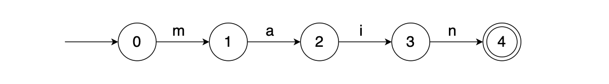
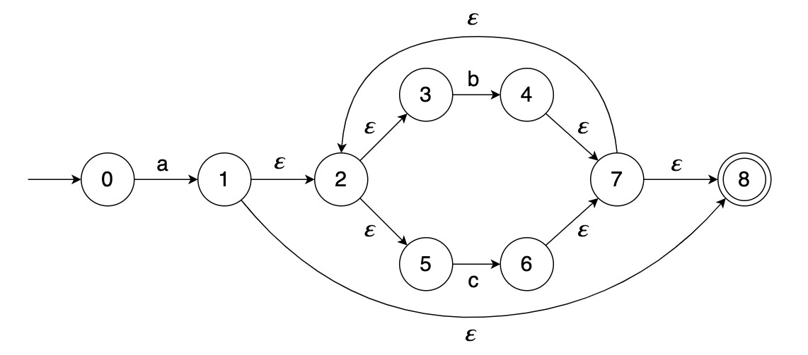
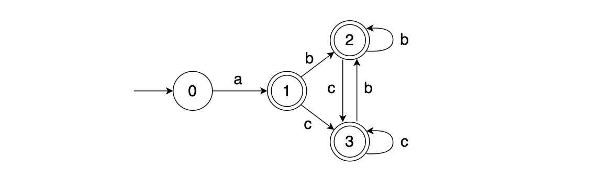
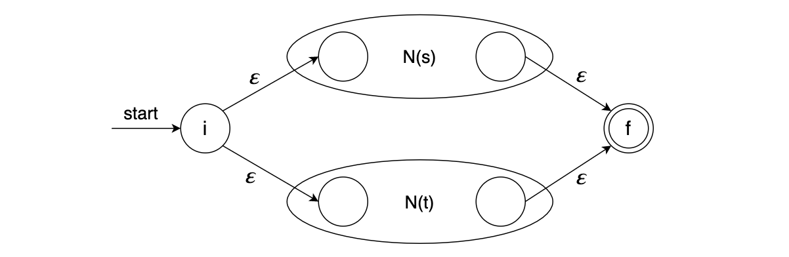
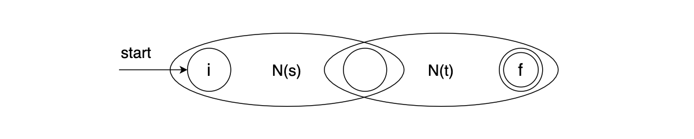
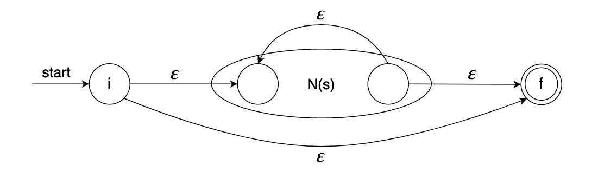

#### 1. 前言

形式语言作为基于特定字符集的字符串集合，需要有某种明确的标准来定义一个字符串是否是它的元素，这可以通过形式文法，正则表达式，有穷自动机等多种表示方法来完成。其中正则表达式是一种具有高度概括性的表示方法，能够用简洁的语法来描述庞大的字符串集合，它的作用是用来简化人们的编码工作。而在计算机中是使用有穷自动机来描述形式语言的，它是一种基于事件驱动的状态转移图，具有和正则表达式相同的表达能力。根据状态转移的性质，有穷自动机分为不确定有穷自动机和确定有穷自动机，本文会先对有穷自动机进行基本介绍，然后介绍一种能够将正则表达式编译成不确定有穷自动机的算法。

#### 2. 有穷自动机

有穷自动机是一种抽象数学模型，它可以根据外部输入来改变自身的状态，从而达到模拟和控制执行流的目的。有穷自动机由五个部分组成，可以用一个五元组 $(S，\Sigma，s，F，\delta)$ 来表示，其中各部分的含义如下所示：

$S$：表示一个有穷状态集合。

$\Sigma$：表示一个输入符号集合。

$s$：代表一个初始状态。

$F$：代表一个接受状态集合。

$\delta$：表示状态之间的转换函数集合。

例如，假设需要识别一个英文字符串是否包含"main"子串，可以利用程序来模拟这样一个有穷自动机。



图1-1是一个非常简单的有穷自动机模型，它从初始状态0开始不断的读入下一个字符并执行状态转换，如果最终自动机能到达接受状态4，则表明输入字符串里面包含"main"子串，否则表明不包含该子串。这样的自动机同样也是由五个部分组成，其中每个部分的具体含义如下：

$S$ ：有限状态集合 $\lbrace 0，1，2，3，4 \rbrace$

$\Sigma$ ：英文字母表 $\lbrace a，b，c，\dots，z，A，B，C，\dots，Z \rbrace$

$s$ ：初始状态 $0$

$F$：接受状态集合 $\lbrace 4 \rbrace$

$\delta$ ：状态转换函数集合 $\lbrace (0，m)\to 1，(1，a)\to 2，(2，i)\to 3，(3，n)\to 4 \rbrace$

根据状态转移的性质，有穷自动机(FA)又分为不确定有穷自动机(NFA)和确定有穷自动机(DFA)，NFA允许对空串输入 $\epsilon$ 进行状态转移，并且对同一个输入字符允许转移到多个目标状态。DFA则对这些做了限制，不允许基于空串的状态转移，对同一个输入字符只能转移到一个目标状态。NFA和DFA在表达力上是等价的，任何DFA都是某个NFA的一个特例，同时任何NFA都可以通过一个DFA来模拟。例如下面的NFA和DFA描述的是同一种语言。

1）可以识别模式 $a(b|c)^*$ 的NFA如图1-2所示。



2）可以识别模式 $a(b|c)^*$ 的DFA如图1-3所示。



从上面两幅图可以看出，NFA的状态转移具有不确定性而DFA的状态转移是确定的，对于机器来说不确定性会产生大量回溯，从而导致NFA的执行性能不如DFA。另一方面，基于正则表达式直接构造NFA会比直接构造DFA更加简单并且所需的时间更少，所以在实际应用中需要结合场景来使用NFA或者DFA。一般来说，对于复杂并且需要多次复用的正则表达式，直接编译成DFA来模拟效果会更好；而对于简单并且只使用几次的正则表达式而言，使用NFA来模拟效果会更好。对二者之间具体区别的概括如下表所示。

| 描述                                   | 不确定有穷自动机(NFA) | 确定有穷自动机(DFA) |
| -------------------------------------- | --------------------- | ------------------- |
| 是否允许基于空串 $\epsilon$ 的状态转换 | 是                    | 否                  |
| 单个输入可转换的目标状态数量           | 多个                  | 一个                |
| 基于正则表达式进行构建的复杂度         | 简单                  | 复杂                |
| 初始构建所需时间                       | 少                    | 多                  |
| 识别字符串所需时间                     | 多                    | 少                  |
#### 3. Thompson算法概述

上一篇文章中我们讨论过复杂正则表达式可以由简单正则表达式通过并集，连接，闭包等基础运算构造而成，Thompson算法就是利用这种归纳思想来将一个正则表达式转化成为一个等价的NFA的，该算法通过递归地将一个正则表达式划分成构成它的子表达式，在得到每个子表达式对应的NFA之后，根据子表达式之间的运算关系和一系列规则来构造表达式自身对应的NFA。下面分别描述通过子表达式NFA构造自身NFA的运算规则。

##### 3.1 最小NFA构造

假设 $r_1=\epsilon，r_2=a$，代表 $r_1$ 的NFA如图1-4左侧所示，代表 $r_2$ 的NFA如图1-4右侧所示。这里空串 $\epsilon$ 和单个字符 $a$ 都是最小的正则表达式，因此无需继续递归，通过它们构造NFA的规则是：新建一个开始状态 $i$ 和一个接受状态 $f$，将这两个状态直接相连，标号可以是空串 $\epsilon$ 或者单个字符，由此得到的NFA只有一次状态转换。


##### 3.2 并集运算

假设 $r=s|t$， $r$ 的NFA即 $N(r)$ 可以通过图1-5构造得到。这里 $i$ 和 $f$ 是新状态，分别是 $N(r)$ 的开始状态和接受状态。从 $i$ 到 $N(s)$ 和 $N(t)$ 的开始状态各有一个 $\epsilon$ 转换，从 $N(s)$ 和 $N(t)$ 到接受状态 $f$ 也各有一个 $\epsilon$ 转换。请注意，$N(s)$ 和 $N(t)$ 的接受状态在 $N(r)$ 中不是接受状态。因为从 $i$ 到 $f$ 的任何路径要么只通过 $N(s)$，要么只通过 $N(t)$ ，且离开 $i$ 或进入 $f$ 的 $\epsilon$ 转换都不会改变路径上的标号，因此我们可以判定 $N(r)$ 可以识别的串集合是 $L(s)\cup L(t)$。



##### 3.3 连接运算

假设 $r=st$，$r$ 的NFA即 $N(r)$ 可以通过图1-6构造得到。$N(s)$ 的开始状态变成了 $N(r)$ 的开始状态。$N(t)$ 的接受状态成为 $N(r)$ 的唯一接受状态。$N(s)$ 的接受状态和 $N(t)$ 的开始状态合并为一个状态，合并后的状态拥有原来进入和离开合并前的两个状态的全部转换。一条从 $i$ 到 $f$ 的路径必须首先经过 $N(s)$，因此这条路径的标号以 $L(s)$ 中的某个串开始。然后，这条路径继续通过 $N(t)$，因此这条路径的标号以 $L(t)$ 中的某个串结束。所以 $N(r)$ 可以识别的串恰好是 $L(s)L(t)$。



##### 3.4 闭包运算

假设 $r=s^*$，$r$ 的NFA即 $N(r)$ 可以通过图1-7构造得到。这里 $i$ 和 $f$ 是两个新状态，分别是 $N(r)$ 的开始状态和接受状态。要从 $i$ 到达 $f$，我们可以沿着新引入的标号为 $\epsilon$ 的路径前进，这个路径对应于 $L(s)^0$ 中的一个串。我们也可以到达 $N(s)$ 的开始状态，然后经过该NFA，再零次或多次从它的接受状态回到它的开始状态并重复上述过程。这些选项使得 $N(r)$ 可以接受$L(s)^1$、$L(s)^2$ 等集合中的所有串，因此 $N(r)$ 可以识别的所有串的集合就是 $L(s)^*$。



#### 4. Thompson算法实现

```java
package com.liuyun.github.test;

import java.util.ArrayList;
import java.util.List;
import java.util.Stack;

public class Thompson {

    /**
     * 编译正则表达式
     * @param regex
     * @return
     */
    public static NFA compile(String regex){
        //验证输入字符串是否是正则表达式
        if (!validRegEx(regex)){
            System.out.println("Invalid Regular Expression Input.");
            return new NFA();
        }
        //操作符栈
        Stack<Character> operators = new Stack();
        //操作数栈
        Stack <NFA> operands = new Stack();
        //连接数栈
        Stack <NFA> concatStack = new Stack();
        //连接标识
        boolean ccflag = true;
        //当前操作符和字符
        char op, c;
        int paraCount = 0;
        NFA nfa1, nfa2;

        for (int i = 0; i < regex.length(); i++){
            c = regex.charAt(i);
            if (alphabet(c)){
                operands.push(new NFA(c));
                if (ccflag){
                    //用'.'替换连接符
                    operators.push('.');
                } else {
                    ccflag = true;
                }
            } else{
                if (c == ')'){
                    ccflag = true;
                    if (paraCount == 0){
                        System.out.println("Error: More end paranthesis than beginning paranthesis");
                        System.exit(1);
                    } else{
                        paraCount--;
                    }
                    //处理操作符栈直到遇到左括号
                    while (!operators.empty() && operators.peek() != '('){
                        op = operators.pop();
                        if (op == '.'){
                            nfa2 = operands.pop();
                            nfa1 = operands.pop();
                            operands.push(concat(nfa1, nfa2));
                        } else if (op == '|'){
                            nfa2 = operands.pop();
                            if(!operators.empty() && operators.peek() == '.'){
                                concatStack.push(operands.pop());
                                while (!operators.empty() && operators.peek() == '.'){
                                    concatStack.push(operands.pop());
                                    operators.pop();
                                }
                                nfa1 = concat(concatStack.pop(), concatStack.pop());
                                while (concatStack.size() > 0){
                                    nfa1 = concat(nfa1, concatStack.pop());
                                }
                            } else{
                                nfa1 = operands.pop();
                            }
                            operands.push(union(nfa1, nfa2));
                        }
                    }
                } else if (c == '*'){
                    operands.push(kleene(operands.pop()));
                    ccflag = true;
                } else if (c == '('){
                    operators.push(c);
                    paraCount++;
                    ccflag = false;
                } else if (c == '|'){
                    operators.push(c);
                    ccflag = false;
                }
            }
        }
        while (operators.size() > 0){
            if (operands.empty()){
                System.out.println("Error: imbalanace in operands and operators");
                System.exit(1);
            }
            op = operators.pop();
            if (op == '.'){
                nfa2 = operands.pop();
                nfa1 = operands.pop();
                operands.push(concat(nfa1, nfa2));
            } else if (op == '|'){
                nfa2 = operands.pop();
                if( !operators.empty() && operators.peek() == '.'){
                    concatStack.push(operands.pop());
                    while (!operators.empty() && operators.peek() == '.'){
                        concatStack.push(operands.pop());
                        operators.pop();
                    }
                    nfa1 = concat(concatStack.pop(), concatStack.pop());
                    while (concatStack.size() > 0){
                        nfa1 = concat(nfa1, concatStack.pop());
                    }
                } else{
                    nfa1 = operands.pop();
                }
                operands.push(union(nfa1, nfa2));
            }
        }
        return operands.pop();
    }

    /**
     * 判断输入字符是否是字母
     * @param c
     * @return
     */
    public static boolean alpha(char c){ return c >= 'a' && c <= 'z';}

    /**
     * 判断输入字符是否是字母或空串
     * @param c
     * @return
     */
    public static boolean alphabet(char c){ return alpha(c) || c == 'E';}

    /**
     * 判断是否是正则运算符
     * @param c
     * @return
     */
    public static boolean regexOperator(char c){
        return c == '(' || c == ')' || c == '*' || c == '|';
    }

    /**
     * 校验输入字符是否合法
     * @param c
     * @return
     */
    public static boolean validRegExChar(char c){
        return alphabet(c) || regexOperator(c);
    }

    /**
     * 验证是否是正则表达式
     * @param regex
     * @return
     */
    public static boolean validRegEx(String regex){
        if (regex.isEmpty()) {
            return false;
        }
        for (char c: regex.toCharArray()) {
            if (!validRegExChar(c)) {
                return false;
            }
        }
        return true;
    }

    /**
     * 并集运算
     * @param n
     * @param m
     * @return
     */
    public static NFA union(NFA n, NFA m){
        //新NFA的状态数是原NFA状态数加2
        NFA result = new NFA(n.states.size() + m.states.size() + 2);

        //添加一条从0到1的空转换
        result.transitions.add(new Transition(0, 1, 'E'));

        //复制n的转移函数到新NFA中
        for (Transition t : n.transitions){
            result.transitions.add(new Transition(t.from + 1, t.to + 1, t.symbol));
        }

        //添加一条从n的最终状态到新NFA最终状态的空转换
        result.transitions.add(new Transition(n.states.size(), n.states.size() + m.states.size() + 1, 'E'));

        //添加一条从0到m的初始状态的空转换
        result.transitions.add(new Transition(0, n.states.size() + 1, 'E'));

        //复制m的转移函数到新NFA中
        for (Transition t : m.transitions){
            result.transitions.add(new Transition(t.from + n.states.size() + 1, t.to + n.states.size() + 1, t.symbol));
        }

        //添加一条从m的最终状态到新NFA最终状态的空转换
        result.transitions.add(new Transition(m.states.size() + n.states.size(), n.states.size() + m.states.size() + 1, 'E'));

        //设置新NFA的最终状态
        result.finalState = n.states.size() + m.states.size() + 1;
        return result;
    }

    /**
     * 连接运算
     * @param n
     * @param m
     * @return
     */
    public static NFA concat(NFA n, NFA m){
        int nsize = n.states.size();
        //删除m的初始状态
        m.states.remove(0);

        //复制m的转移函数到n
        for (Transition t : m.transitions){
            n.transitions.add(new Transition(t.from + nsize - 1, t.to + nsize - 1, t.symbol));
        }

        //添加m的状态到n中
        for (Integer s : m.states){
            n.states.add(s + nsize - 1);
        }

        //设置n的最终状态
        n.finalState = nsize + m.states.size() - 1;
        return n;
    }

    /**
     * 柯林闭包
     * @param n
     * @return
     */
    public static NFA kleene(NFA n) {
        //新NFA的状态数是原NFA状态数加2
        NFA result = new NFA(n.states.size() + 2);

        //添加一条从0到1的空转换
        result.transitions.add(new Transition(0, 1, 'E'));

        //复制原NFA的转移函数到新NFA中
        for (Transition t : n.transitions){
            result.transitions.add(new Transition(t.from + 1, t.to + 1, t.symbol));
        }

        //添加一条从原NFA最终状态到新NFA最终状态的空转换
        result.transitions.add(new Transition(n.states.size(), n.states.size() + 1, 'E'));

        //添加一条从原NFA的最终状态到初始状态的空转换
        result.transitions.add(new Transition(n.states.size(), 1, 'E'));

        //添加一条从新NFA的初始状态到最终状态的空转换
        result.transitions.add(new Transition(0, n.states.size() + 1, 'E'));

        //设置新NFA的最终状态
        result.finalState = n.states.size() + 1;
        return result;
    }

    public static class NFA {
        /** 状态集合 */
        public List<Integer> states;
        /** 状态转移函数集合 */
        public List <Transition> transitions;
        /** 最终状态 */
        public int finalState;

        public NFA(){
            this.states = new ArrayList();
            this.transitions = new ArrayList();
            this.finalState = 0;
        }

        public NFA(int size){
            this.states = new ArrayList();
            this.transitions = new ArrayList();
            this.finalState = 0;
            this.setStateSize(size);
        }

        public NFA(char c){
            this.states = new ArrayList();
            this.transitions = new ArrayList();
            this.setStateSize(2);
            this.finalState = 1;
            this.transitions.add(new Transition(0, 1, c));
        }

        public void setStateSize(int size){
            for (int i = 0; i < size; i++) {
                this.states.add(i);
            }
        }

        public void display(){
            for (Transition t: transitions){
                System.out.println("("+ t.from +", "+ t.symbol + ", "+ t.to +")");
            }
        }
    }

    private static class Transition {
        /** 当前状态 */
        public int from;
        /** 目标状态 */
        public int to;
        /** 标号字符 */
        public char symbol;

        public Transition(int from, int to, char symbol){
            this.from = from;
            this.to = to;
            this.symbol = symbol;
        }
    }

    public static void main(String[] args) {
        NFA nfa = Thompson.compile("a(b|c)*");
        nfa.display();
    }

}
```

这里使用正则表达式 $a(b|c)^*$ 来进行测试，并将构造出的NFA在控制台打印输出，其中输出结果的每一行由初始状态，转移字符和目标状态三元组组成，并使用字符E来代表空串 $\epsilon$，将结果绘制成带标号边的状态转移图即可得到图1-2所示的NFA。

```shell
(0, a, 1)
(1, E, 2)
(2, E, 3)
(3, b, 4)
(4, E, 7)
(2, E, 5)
(5, c, 6)
(6, E, 7)
(7, E, 8)
(7, E, 2)
(1, E, 8)
```

