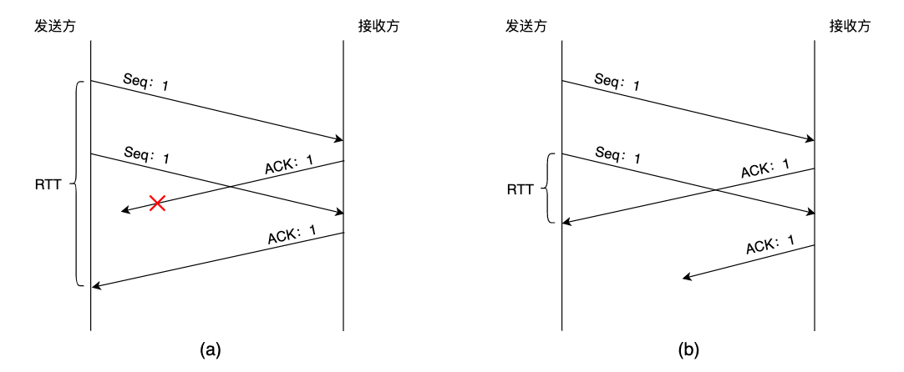
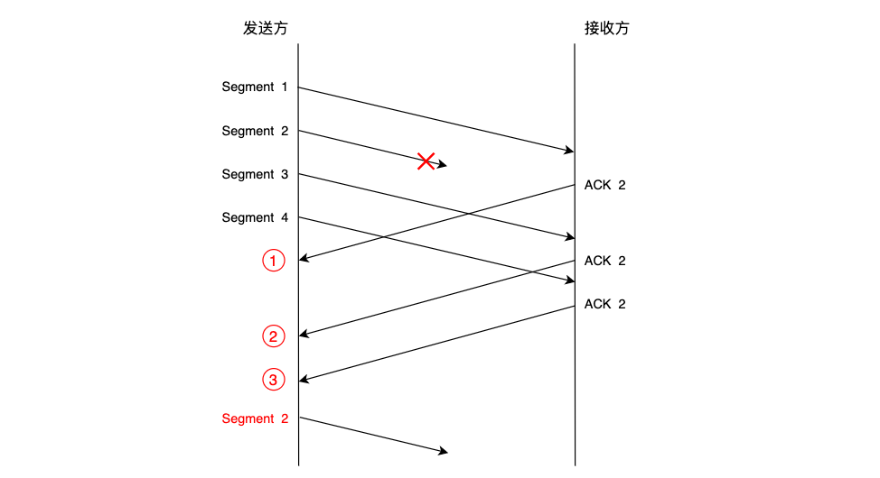
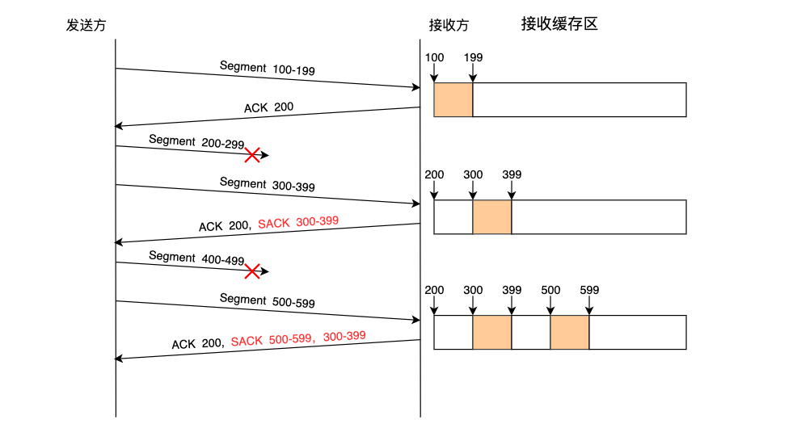

#### 1. 前言

我们都知道物理网络媒介容易受到环境因素影响而产生波动，导致传输的数据受损或者丢失，如何在这种环境下确保接收方接收到的数据就是发送方所发送的数据，这一问题困扰了科学家很多年。一般来说目前主要有两种解决思路，对于数据受损问题我们可以采用差错校验码来检测和恢复，而对于数据丢失问题我们只能通过重传数据包来解决。TCP协议是一种可靠的数据传输协议，为了保证数据传输的正确性，TCP同时采用了差错校验码和重传机制。本篇我们重点关注TCP的重传机制，重传数据包是在检测出丢包的情况下进行触发的，TCP会根据接收端返回至发送端的一系列确认信息来判断是否出现丢包。根据判断丢包依据的不同，重传又分为超时重传、快速重传和选择重传，下面分别为大家进行介绍。

#### 2. 超时重传

发送方在发送每个报文段时会为该报文段设置一个计时器，若在指定时间内未收到接收方对该报文段的确认信息，则判断可能出现丢包，因此需要发送方进行重传。这里麻烦的一点是，我们应该设置超时时间为多少才合适？若超时时间设置的过短，则可能导致重复发送报文进而引起网络拥塞；若超时时间设置的过长，则可能导致网络变的空闲进而降低吞吐量。除此之外，超时时间还需要随着网络环境的不断变化而进行动态调整。可见重传超时时间(Retransmission TimeOut，RTO)的设置很大程度影响了TCP协议的传输性能。由于底层协议不提供任何关于网络环境的确切信息，因此需要TCP协议自行设计和采集样本数据。我们可以通过测量每个数据包从发送到收到确认信息的往返时间(Round Trip Time，RTT)来动态估算出RTO的值。在研究如何恰当设置RTO的值的过程中，出现了以下几种典型的解决方案。

##### 2.1 常见的方案

##### 2.1.1 经典算法

$$
SRTT\gets\alpha(SRTT)+(1-\alpha)RTT_s \tag{1.1}
$$

$$
RTO = min(ubound, max(lbound, (SRTT)\beta)) \tag{1.2}
$$

如公式1.1所示，SRTT代表一组RTT样本的平均值，每当获取到新的RTT样本值时SRTT就会进行更新，其中平滑因子 $\alpha$ 的推荐值为0.8～0.9，也就是说新的SRTT值有80%～90%来自现存值，10%～20%来自新测量值。这种方法称为加权移动平均法，这样可以使SRTT的值随着网络环境的变化进行动态调整。一般来说RTO需要略大于RTT样本平均值，因此我们将SRTT乘上一个 $\beta$ 常量，该值推荐为1.3～2.0，从而得到最终的RTO。考虑到RTO的值应该在一个合理范围内波动，因此公式1.2为RTO设置了上下边界，其中上边界ubound的值建议为1分钟，下边界lbound的值建议为1秒钟。该算法在相对稳定的RTT分布环境中能取得不错的性能。

##### 2.1.2 Karn算法

在使用经典算法来统计RTT样本时会出现重传二义性的问题。所谓重传二义性问题是指，假设一个包的传输出现超时，该数据包会被重传，接着收到一个确认信息。那么该信息是对第一次还是第二次传输的确认就存在二义性。如果对重传数据包进行RTT样本统计，那么会出现下面两种情况。

a）统计第一次发送和ACK到达时间的间隔，若此时的ACK是对第二次发送进行确认，那么RTT会偏大。

b）统计第二次发送和ACK到达时间的间隔，若此时的ACK是对第一次发送进行确认，那么RTT会偏小。



为了避免由于重传数据的RTT样本值的不准确而影响RTT平均估计值的统计，Karn算法做的第一部分是忽略重传的情况，也就是不对重传数据包进行采样。然而这样会导致另一个问题，就是如果出现网络突然抖动而产生较大延时，此时所有数据包都因超时而被重传，由于被重传的数据不纳入RTT样本统计，导致RTO仍然处于较小的值，此时会继续重传不必要的数据包而导致网络拥塞。Karn算法的第二部分是采用退避系数加倍来解决这个问题的，也就是说每当出现重传时RTO的值会进行翻倍。此方法虽然能解决上述问题，但也可能使TCP的传输性能降低，更好的方式是使用时间戳选项来避免重传二义性问题。

##### 2.1.3 Jacobson算法

$$
srtt\gets(1-g)(srtt)+(g)M \tag{1.3}
$$
$$
rttvar\gets(1-h)(rttvar)+(h)(\mid{M-srtt}\mid) \tag{1.4}
$$
$$
 RTO = srtt + 4(rttvar) \tag{1.5}
$$

此前我们说过RTO的值应该略大于RTT样本平均值，在经典算法中是通过对SRTT乘上一个 $\beta$ 常量来得到最终的RTO值的。该方法不是很灵活，因此Jacobson算法对此进行了改进。使用平均偏差来作为RTO和SRTT的差值，这样就使得当RTT的分布越平稳时，RTO的值就接近SRTT；而当RTT的波动越大时，RTO的值就越大于SRTT。完整的计算过程如公式1.3～1.5所示，其中M表示新测量的RTT样本值，参数g推荐设为1/8，rttvar表示平均偏差，参数h推荐设为1/4，RTO的值为srtt加上4倍的rttvar。

##### 2.2 Linux采用的方案

尽管Jacobson算法是目前TCP协议用于估算RTO的标准方法，但仍存在一些问题：例如当RTT新样本值突然变小时，此时RTO的值按理来说应该减小而不是增大；还有当采用更频繁的RTT测量和更细的时钟粒度时，平均偏差rttvar的值很容易随着时间减为最小。Linux在此基础上做了一些改进来避免这些问题。

(1) 为rttvar设置最小值，在不低于下界的情况下rttvar的值取自测量RTT样本过程中的最大平均偏差估计值。完整的公式如下所示，使用mdev变量记录瞬时平均偏差估计值，即标准方法中的rttvar，通过mdev_max变量来保存测量过程中的最大平均偏差估计值，并设置其最小值为50ms。由于rttvar的值同步于mdev_max，因此可以保证RTO的最小值不小于200ms，这样就解决了在频繁测量时rttvar的值随时间减为最小的问题。
$$
srtt\gets(1-g)(srtt)+(g)M \tag{1.6}
$$
$$
mdev\gets(1-h)(mdev)+(h)(\mid{M-srtt}\mid) \tag{1.7}
$$
$$
mdev\\_ max\gets max(mdev\\_ max, mdev) \tag{1.8}
$$
$$
rttvar\gets mdev\\_ max \tag{1.9}
$$
$$
 RTO = srtt + 4(rttvar) \tag{2.0}
$$

(2) 当新样本值小于RTT估计范围下界时，通过减少新样本的权重来避免RTO增大问题。具体实现思路由下面这段代码给出，当新测量样本值m小于估计范围下界(srtt - mdev)时，表明此时的RTT正处于急剧减小的状态，通过将新样本平均偏差|srtt-m|的权重减少为原来的1/8，即可避免由于mdev的增大而导致RTO增大的问题。

```c
if(m < (srtt - mdev)) {
    mdev = (31/32)*mdev + (1/32)*|srtt - m|
} else {
    mdev = (3/4)*mdev + (1/4)*|srtt - m|
}
```

#### 3. 快速重传

快速重传机制基于接收端的反馈信息来引发重传，而非重传计时器的超时。因此与超时重传相比，快速重传能够更加及时有效地修复丢包情况。典型的TCP同时实现了这两种重传机制。快速重传的工作原理是，当接收方收到一个失序的数据包时，会立即发送一个重复ACK，发送方在接收到一定数量的重复ACK后会重传之前的数据包。由于收到重复ACK并不代表数据包已经丢失，也有可能是网络中出现失序分组造成的，因此发送方需要等待收到的重复ACK数量达到一定阈值后才会进行重传。通常这个阈值会设置为3，也有些实现可以基于当前的失序程度来动态调整该阈值。具体的工作流程如下图所示。



#### 4. 选择性重传

虽然快速重传能够比超时重传更加及时的检测出是否存在丢包的情况，但无法确切得知是哪些数据包丢失了，因此可能会重传已经被正确接收的包，从而降低TCP的传输效率。例如上图中发送方连续收到3个重复的ACK，由于这些重复ACK可能是被报文段2之后的任意报文段所触发的，因此发送方不能确定是否需要重传报文段2之后的其他数据包。为了改善这种情况，TCP在头部引入了SACK选项。通过采用SACK选项，一个ACK可以包含三四个告知失序数据的SACK块信息，每个SACK块包含失序数据的起始序列号和终止序列号。因此，若不考虑拥塞控制的情况，利用SACK选项发送方最多能够在一个RTT时间内填补3个接收端的缓存空缺，从而有效的提升TCP的传输性能。具体工作原理如下图所示。



#### 5. 参考资料

> 1. [TCP/IP详解 卷1：协议](https://book.douban.com/subject/1088054/)
> 2. [TCP的哪些事儿(上)  || 酷壳 - CoolShell](https://coolshell.cn/articles/11564.html) 
> 3. [TCP的哪些事儿(下)  || 酷壳 - CoolChell](https://coolshell.cn/articles/11609.html) 
> 4. [Improving Round-Trip Time Estimates in Reliable Transport Protocols](chrome-extension://ikhdkkncnoglghljlkmcimlnlhkeamad/pdf-viewer/web/viewer.html?file=http%3A%2F%2Fccr.sigcomm.org%2Farchive%2F1995%2Fjan95%2Fccr-9501-partridge87.pdf)
> 5. [传输控制协议 -- 维基百科](https://zh.wikipedia.org/wiki/%E4%BC%A0%E8%BE%93%E6%8E%A7%E5%88%B6%E5%8D%8F%E8%AE%AE)

